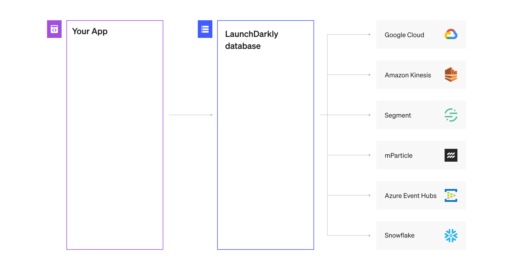

This guide helps authors and developers unify implementation by providing you with components, tokens and practices for our docsite.

### Table of Contents

- Best practices & gotchas
- **Components**
- LearnMore
- Callout
- CodeTabs
- CodeTabItem
- Table
- Image
- **Tokens**
- Typography
- Spacing
- Color

# Best practices & gotchas

Translating markdown and HTML components into human-usable formatting can be scary. Follow these best practices to have a better experience:

* Line breaks to separate HTML-style tags in React components from other types of content. For example:
```  
  <Callout intent="info">
  <CalloutTitle>CALLOUT-TITLE</CalloutTitle>
  <CalloutDescription>

CALLOUT CONTENT.

  </CalloutDescription>
</Callout>
```

* Left-justify text content inside callouts

  As pictured above. Callout contents do not respect markdown unless they are left-justified. 

* Line breaks after every component
   
  Separate headers, components, and other formatting with a paragraph break. This ensures the text formats correctly. Don't worry about inline links, those don't mess up any formatting. 
  
```
# EXAMPLE HEADER
< -- this line deliberately left blank -- > 
Content content.
```

## Formatting callouts

You can put code samples and markdown into callouts in one of two ways. 

Use a code block:

```
<CalloutTitle><code>more_code</code></CalloutTitle>
```

Or insert blank lines above and below where you want to use the markdown:

```
<Callout intent="info">
  <CalloutTitle>

`more_code`

  </CalloutTitle>
  <CalloutDescription>

`even_more_code`

  </CalloutDescription>
</Callout>
```

### Different types of callouts

There are four different types of callouts:

```
<Callout intent="info"> (blue)

<Callout intent="alert"> (yellow)

<Callout intent="warning"> (red)

<Callout intent="primary"> (green)
```

# Components

## Learn more

### Single

<LearnMore>
  <LearnMoreLink to="/foobar">Single link</LearnMoreLink>
</LearnMore>

<CodeTabs
  defaultValue="text"
  values={[
    { label: 'Single Learn More', value: 'text', },
  ]
}>
<CodeTabItem value="text">

```js
<LearnMore>
  <LearnMoreLink to="/foobar">Single link</LearnMoreLink>
</LearnMore>
```

</CodeTabItem>
</CodeTabs>

### Multiple

<LearnMore>
  <LearnMoreLink to="/foobar">This is an internal link</LearnMoreLink>
  <LearnMoreLink to="http://reactjunkie.com">External link</LearnMoreLink>
  <LearnMoreLink to="/foobar">Another internal link</LearnMoreLink>
</LearnMore>


<CodeTabs
  defaultValue="LearnMore"
  values={[
    { label: 'Multiple Learn More', value: 'LearnMore', },
  ]
}>
<CodeTabItem value="LearnMore">

```js
<LearnMore>
  <LearnMoreLink to="/foobar">This is an internal link</LearnMoreLink>
  <LearnMoreLink to="http://reactjunkie.com">External link</LearnMoreLink>
  <LearnMoreLink to="/foobar">Another internal link</LearnMoreLink>
</LearnMore>
```

</CodeTabItem>
</CodeTabs>


## Image



<CodeTabs
  defaultValue=""
  values={[
    { label: 'Image', value: 'Image', },
  ]
}>

<CodeTabItem value="Image">

```markdown

```

</CodeTabItem>
</CodeTabs>

## Callout

### Primary

<Callout intent="primary">
  <CalloutTitle>Adding users to LaunchDarkly</CalloutTitle>
  <CalloutDescription>
    You do not have to send users to LaunchDarkly in advance. <a href="">Check out this page</a>. You can target them
    with feature flags have LaunchDarkly accounts of their own. Users appear in the dashboard automatically after they
    encounter feature flags.
  </CalloutDescription>
</Callout> 

### Alert

<Callout intent="alert">
  <CalloutTitle>Adding users to LaunchDarkly</CalloutTitle>
  <CalloutDescription>
    You do not have to send users to LaunchDarkly in advance. <a href="">Check out this page</a>. You can target them
    with feature flags have LaunchDarkly accounts of their own. Users appear in the dashboard automatically after they
    encounter feature flags.
  </CalloutDescription>
</Callout> 

### Warning

<Callout intent="warning">
  <CalloutTitle>Adding users to LaunchDarkly</CalloutTitle>
  <CalloutDescription>
    You do not have to send users to LaunchDarkly in advance. <a href="">Check out this page</a>. You can target them
    with feature flags have LaunchDarkly accounts of their own. Users appear in the dashboard automatically after they
    encounter feature flags.
  </CalloutDescription>
</Callout> 

### Info

<Callout intent="info">
  <CalloutTitle>Adding users to LaunchDarkly</CalloutTitle>
  <CalloutDescription>
    You do not have to send users to LaunchDarkly in advance. <a href="">Check out this page</a>. You can target them
    with feature flags have LaunchDarkly accounts of their own. Users appear in the dashboard automatically after they
    encounter feature flags.
  </CalloutDescription>
</Callout> 


<CodeTabs
  defaultValue="Callout"
  values={[
    { label: 'Callout', value: 'Callout', },
  ]
}>
<CodeTabItem value="Callout">

```js
<Callout intent="primary"> <!-- OR alert, warning, info -->
  <CalloutTitle>Adding users to LaunchDarkly</CalloutTitle>
  <CalloutDescription>
    You do not have to send users to LaunchDarkly in advance. <a href="">Check out this page</a>. You can target them
    with feature flags have LaunchDarkly accounts of their own. Users appear in the dashboard automatically after they
    encounter feature flags.
  </CalloutDescription>
</Callout> 
```

</CodeTabItem>
</CodeTabs>

## Code samples

1. Write code block as markdown as usual.
2. Add a `CodeTabs` component with a default value (which will be the first tab shown) and a values array of objects with a label and value.
3. Each CodeTabItem will be one of the tabs


<CodeTabs
  defaultValue="code"
  values={[
    { label: 'Code snippet', value: 'code', },
  ]
}>
<CodeTabItem value="code">

```js
<CodeTabs
  defaultValue="js"
  values={[
    { label: 'JavaScript', value: 'js', },
    { label: 'Python', value: 'py', },
    { label: 'Java', value: 'java', },
  ]
}>

    <CodeTabItem value="js">

    ```js
    function helloWorld() {
      console.log('Hello, world!');
    }
    ```

    </CodeTabItem>
    <CodeTabItem value="py">

    ```py
    def hello_world():
      print 'Hello, world!'
    ```

    </CodeTabItem>
    <CodeTabItem value="java">

    ```java
    class HelloWorld {
      public static void main(String args[]) {
        System.out.println("Hello, World");
      }
    }
    ```

    </CodeTabItem>

</CodeTabs>
```

</CodeTabItem>
</CodeTabs>
