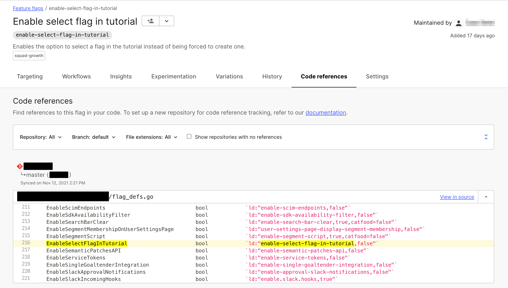
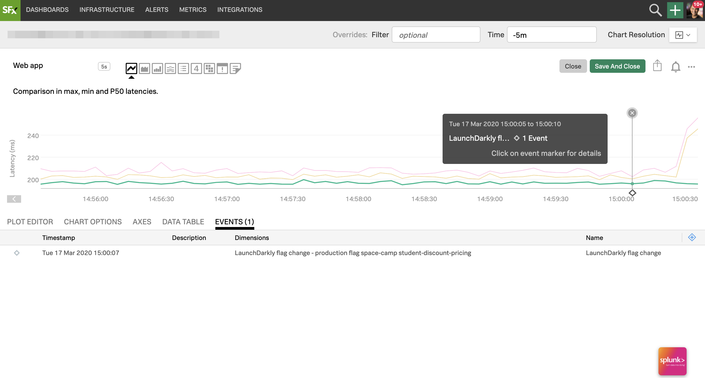

# Overview

This guide explains how using LaunchDarkly in concert with other tools enhances your team's ability to react when issues arise. You can use our integrations to enhance collaboration, change management, and many other business areas.

LaunchDarkly offers many integrations with third-party services that let your existing tools work in concert with your feature flagging practices.

# Learning about different types of integrations

LaunchDarkly's integrations span a variety of categories, including monitoring, messaging, code references, issue management, and Data Export.

To see a list of all supported integrations, visit the [Integrations page](https://app.launchdarkly.com/integrations) in your LaunchDarkly app, or read the [Integrations documentation](/integrations).

## Using Git Code References

The LaunchDarkly Git Code References tool
integrates with your CI tool to identify where LaunchDarkly flags occur in your code.

A best practice for managing feature flags is archiving flags you no longer need. Identifying where those flags are referenced in code can be difficult, especially if you have more than one repository to
search through.

After you turn this integration on, navigate to the dashboard of the flag you want to archive. The "Code references" tab shows you everywhere that flag appears in your code.

<LearnMore>
  <LearnMoreLink to="/integrations/git-code-references">Git code references</LearnMoreLink>
</LearnMore>

## Monitoring 

LaunchDarkly offers integrations with many modern monitoring and observability tools.

Many software teams use monitoring and observability tools to identify anomalies. You can even use tools like these to catch when bugs are introduced by your feature flagging practices.

These integrations make it
possible to surface flag change events displaying them in context
with other events or metrics being monitored and tracked inside the corresponding
tool.

<LearnMore>
  <LearnMoreLink to="/integrations/datadog">Datadog</LearnMoreLink>
  <LearnMoreLink to="/integrations/dynatrace">Dynatrace</LearnMoreLink>
  <LearnMoreLink to="/integrations/logdna">LogDNA</LearnMoreLink>
  <LearnMoreLink to="/integrations/honeycomb">Honeycomb</LearnMoreLink>
  <LearnMoreLink to="/integrations/signalfx">SignalFx</LearnMoreLink>
  <LearnMoreLink to="/integrations/splunk">Splunk</LearnMoreLink>
</LearnMore>

## Issue tracking 

LaunchDarkly has integrations that support common engineering workflows and tools.

It is useful to be able to control or manage features and feature flags from project management tools.

For example, you can associate an existing flag with a project ticket, and the flag is turned on when the ticket is approved.

<LearnMore>
  <LearnMoreLink to="/integrations/jira">Jira</LearnMoreLink>
  <LearnMoreLink to="https://trello.com/power-ups/5d795c43ef5f7d1dc307da46">Trello</LearnMoreLink>
</LearnMore>

## Messaging

When teams are distributed, it is useful to be able to centralize information about your feature flags in messaging and collaboration tools that many teams in your organization use. 

We have integrations that allow LaunchDarkly to send notifications and even gives
authorized users the ability to trigger flag changes from different apps.

<LearnMore>
  <LearnMoreLink to="/integrations/microsoft-teams">Microsoft Teams</LearnMoreLink>
  <LearnMoreLink to="/integrations/slack">Slack</LearnMoreLink>
</LearnMore>

## Developer tools

Developer tools are the place where developers spend most of their day and do most of their work, so it makes sense that we built integrations that allow them to schedule ring deployments or perform internal testing directly from their tool.

<LearnMore>
  <LearnMoreLink to="/integrations/dynatrace">Dynatrace</LearnMoreLink>
  <LearnMoreLink to="/integrations/terraform">Terraform</LearnMoreLink>
</LearnMore>

## Using Data Export

<Callout intent="info">
  <CalloutTitle>Data Export is an add-on feature for Enterprise plans</CalloutTitle>
  <CalloutDescription>

Data Export is only available to customers on our Enterprise plans. To learn
more about our plans, read about [LaunchDarkly's pricing](https://launchdarkly.com/pricing/). If you want to add Data Export to
an existing plan, contact your LaunchDarkly account representative.
  </CalloutDescription>
</Callout>

Data Export allows companies to do extremely detailed and rich analysis of flag
evaluations and behavior. You can export a configrable log stream to a destination such
as Kinesis, Google PubSub, or others.

<LearnMore>
  <LearnMoreLink to="/integrations/data-export">Data Export</LearnMoreLink>
</LearnMore>

## Building your own integration

We're building more integrations all the time as customers or partners request them.

If you want to build an integration yourself, or request one from us, contact Support or your LaunchDarkly account representative.

# Conclusion

Integrations are a way to incorporate LaunchDarkly's powerful feature-flagging capabilities into your existing workflow, or to enhance LaunchDarkly's reporting and analytics capabilities.

This guide summarized some of the integrations available in LaunchDarkly and how you can use them to help your team work better.

<Callout intent="primary">
  <CalloutTitle>Want to know more? Start a trial.</CalloutTitle>
  <CalloutDescription>

Your 30-day trial begins as soon as you sign up. Learn to use LaunchDarkly with the app's built-in quick start guide. You'll see how easy it is to manage the whole feature lifecycle from concept to launch to control.  

Want to try it out? [Start a trial](https://launchdarkly.com/start-trial/).

  </CalloutDescription>
</Callout>
