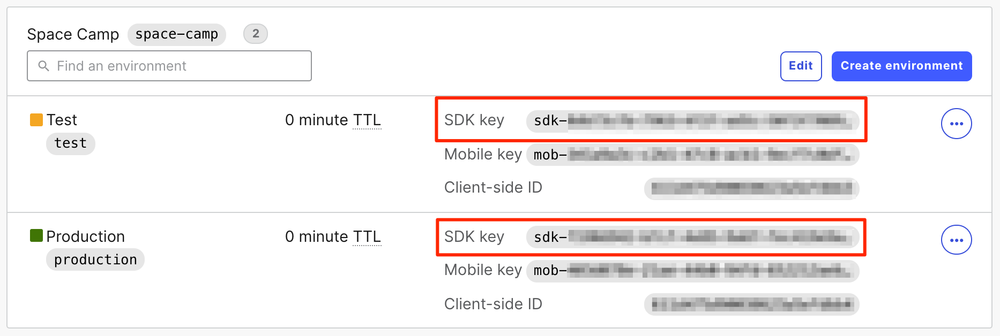
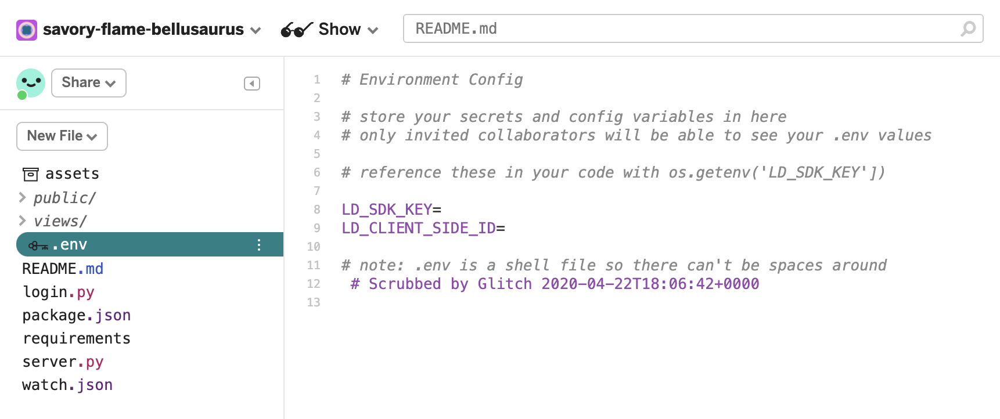

## Overview

This guide explains how to run an experiment in LaunchDarkly. Experiments are useful for product managers, engineers, designers,
or anyone who wants to validate their hypothesis about any part of their platform controlled by feature flags.

In this guide, you will:
- Install and configure a client-side SDK,
- Create a multivariate flag,
- Configure targeting rules,
- Create a metric and connect it to a flag, which creates an experiment, and
- Run and analyze the results of an experiment.

<Callout intent="info">
<CalloutTitle>The experiment in this guide is for example use only</CalloutTitle>
<CalloutDescription>

The experiments in this guide are examples only. They are intended to teach you the basic principles and process of conducting an experiment in LaunchDarkly. Do not replicate this experiment in production and expect rigorously produced results.

To complete an experiement that results in useful data, you should conduct more preparation than is outlined in this guide, including rigorous sampling practices.

To learn more about how to create an effective experiment, read [Designing experiments in LaunchDarkly](/guides/best-practices/experimentation).

</CalloutDescription>
</Callout>

## Prerequisites

To complete this guide, you must have the following prerequisites:

* You must have completed the exercises in [Rules and targeting](/guides/tutorials/rules-and-targeting). The exercises in this guide rely on concepts from that guide. To learn more about how LaunchDarkly's rules and targeting practices, read [Rules and targeting](/guides/tutorials/rules-and-targeting).
* An active LaunchDarkly account with the ability to create a flag.
* Basic knowledge of the Python and JavaScript programming languages. You need these to complete the exercises in this guide.
* "Do not track" must be disabled in your browser for the experiment's click events to work. To confirm that "Do not track" is disabled, visit [AllAboutDNT.com](https://allaboutdnt.com).
* You should be familiar with the concept of experimentation for software products, and know what results you want to determine. To learn more, read [Designing experiments in LaunchDarkly](/guides/best-practices/experimentation).
* You must have Experimentation enabled in your LaunchDarkly account. To enable Experimentation, contact your LaunchDarkly account manager or email sales@launchdarkly.com.
* Access to [Glitch](https://glitch.com/about).

<LearnMore>
  <LearnMoreLink to="https://glitch.com/create">How to use Glitch</LearnMoreLink>
</LearnMore>

## Concepts

The following concepts will help you understand this guide.

### Multivariate flags

A multivariate flag is a feature flag that is not boolean and has more than one possible variation.
Multivariate flags allow you to use one flag to serve multiple variations of a feature simultaneously.

## Setting up the app

This app builds on the same app in the [Rules and targeting](/guides/tutorials/rules-and-targeting)
guide. If you haven't completed that guide yet, read and complete those exercises first and then return to this guide.

The app below begins where the previous guide left off:

<div class="glitch-embed-wrap" style="height: 420px; width: 100%;margin-bottom:24px">
  <iframe
    src="https://glitch.com/embed/#!/embed/ld-space-camp-4?path=README.md&previewSize=0&attributionHidden=true"
    title="ld-space-camp-4 on Glitch"
    style="height: 100%; width: 100%; border: 0;"
  ></iframe>
</div>

To begin, remix the Glitch project to create an editable copy of the app. Use the embedded Glitch app above, or [click here to remix the app](https://glitch.com/edit/#!/remix/ld-space-camp-2).

<LearnMore>
  <LearnMoreLink to="https://glitch.com/create">How to use Glitch</LearnMoreLink>
</LearnMore>

## Setting up the LaunchDarkly project and environment

The LaunchDarkly Python SDK and client-side JavaScript SDK are installed in this app already. You must add your project's SDK key, which we'll do in the next section.

You can re-use the project and environment you created in [Getting started with your first flag](/guides/tutorials/sdk-flag), or create a new one.

Here is an image of where to find your SDK keys:



### Configuring the SDK key and client ID

Glitch lets you store environment variables, such as secrets or config variables, that your app can read from memory. This is a more secure practice than hard-coding these directly into your code.

Here is an image of a sample .env file:



To configure the SDK key and client ID:

1. Find a file called `.env` in the Glitch sidebar.
2. Copy the **SDK key** from the **Test** environment by clicking on the key.
3. Assign the **SDK key** to the environment variable called `LD_SDK_KEY`.
4. Copy the **Client-side ID** from the **Test** environment.
5. Assign the **Client-side ID** to the environment variable called `LD_SDK_KEY`:

<CodeTabs defaultValue="env" values={[{ label: '.env', value: 'env', }]}>
  <CodeTabItem value="env">

```env
LD_SDK_KEY=<your-SDK-key>
LD_CLIENT_SIDE_ID=<your-client-side-id>
```

  </CodeTabItem>
</CodeTabs>

### Creating a multivariate flag

Experiments can use boolean flags for A/B tests, or multivariate flags for A/B/n tests. Multivariate flags have multiple settings
that let you define different variations of one feature. This exercise uses a multivariate flag.

Experiments use multivariate flags to test different versions of a feature. Settings can include strings, numbers, JSON objects, or JSON arrays.

This exercise tests different prices to determine at what price students are more willing to purchase a trip. The trips are discounted to 25%, 50%, and 75% off their original price.

A 25% discount means a student would pay 75% of the original cost of the trip. The equation to calculate this for a $100 trip is `100 * .75`. Similarly, to calculate a 50% discount for a $100 trip, you would enter `100 * .5`

Our application stores numbers like this in an array. We will use a multivariate flag's
value to calculate the discount. To do this, we multiply the values in the
array by a constant .25 for 75% off, .5 for 50% off, and .75 for 25% off.

Each of those values corresponds to one variation of a feature flag. When we run an experiment, we compare how each variation of a flag produces different behavior in our users.

### Creating the "Student Discount Pricing" feature flag

First, create a new flag in LaunchDarkly.

To create a new flag:

1. Click **+ Flag**.
2. Name your flag "Student Discount Pricing" (omit the quotes around the phrase).
4. Enter a description of the flag to help account members understand what the flag is for.
5. Click into the **Tags** dropdown and enter “experiment”. This creates a tag that lets you filter flags based on which flags have experiments running.
6. Check the **SDKs using Client-side ID** checkbox.
7. Under "Flag variations," choose **Number**.
8. Enter a name and value for the variations as given below:
  * Variation 1 value: .25
  * Variation 1 name: 75% off
  * Variation 2 value: .5
  * Variation 2 name: 50% off
  * Variation 3 value: .75
  * Variation 3 name: 25% off
  * Variation 4 value: 1
  * Variation 4 name: No discount


9. Save your new flag.

### Targeting users

A successful experiment requires two or more segments to test against. How you segment your users
will vary based on your business.

Here are some possible ways to segment users:

* Logged in as opposed to anonymous
* By company
* By geography
* Randomly

In this experiment, we target users based on their email address. We want to offer pricing discounts based on
whether a person is a student. Users with a `.edu` email address will be presented
with three different prices.

To target users with a `.edu` email address:

1. In LaunchDarkly, navigate to the **Targeting** menu for your new flag.
1. Under the "Target users who match these rules" section, click **Add a rule**.
1. Under "Select an attribute" choose `email`, `ends with`, and `.edu`.
1. Select a percentage rollout. Enter percentage values for the four variations of your flag. The values must add up to 100%.
1. Toggle flag targeting **on**:


### Adding the flag's code to the application

Now you must update your app to display discounted pricing if a user logs in with a .edu email address.

To update your app:

1. Navigate to your Glitch app.
2. Find the `server.py` file in the sidebar and click to open it.
3. Add or change the pricing array code. Comments in the file indicate where to add the code:

<CodeTabs defaultValue="py" values={[{ label: 'Multivariate flag with discount', value: 'py', }]}>
  <CodeTabItem value="py">

``` py
discount = ld_client.variation('student-discount-pricing', user, 1)
price = np.array([10000, 25000, 100000]) * discount
```

  </CodeTabItem>
</CodeTabs>

### Validating the flag's behavior

Before going on to set up your experiment, confirm the multivariate flag and
targeting rules work.

To confirm the rules work:

1. From the Glitch editing window, click **View app**. The Space Camp app appears.
1. Click **log-in**:


1. Enter a random email ending in .edu.
1. A discounted price of $10,000, $25,000, or $100,000 should appear.
1. Log out.
1. Log in again with a random email ending in .com
1. Standard pricing should appear.

<Callout intent="alert">
<CalloutTitle>Disable "Do not track"</CalloutTitle>
<CalloutDescription>

If you have not disabled "Do not track," you will not be able to log in to the Glitch app. If "Do not track" is disabled, but the login still fails, try disabling ad blockers or popup blockers in your browser as well.

</CalloutDescription>
</Callout>

### Creating a click metric

Metrics let you measure user behaviors affected by your flag. The three types of
metrics are click, pageview, and custom metrics.

To learn more about metrics in experiments, read [Creating experiments](/home/experimentation/create).

First, you must get the URL for your Glitch app. To find it:

1. From the Glitch console, click the **Share** button. A pop-up with a URL appears.
1. Select **Live App** from the pop-up.
1. Copy the Live App URL.
1. Save the URL somewhere where it is easy to access.

<iframe src="https://drive.google.com/file/d/1m43dF6fDtwepQOmOshknJYT3y7US1hOp/preview" width="100%" height="410" style="margin-bottom:24px"></iframe>

Here's how to create a click metric to track the discount which results in the highest number of packages purchased:

1. Navigate to LaunchDarkly.
1. Select **Experiments** from the sidebar menu.
1. Navigate to the **Metrics** tab.
1. Click **+ Metric**. The "Create a new metric screen" appears.
1. Name your metric "Student pricing tier".
1. Enter a **Description** to indicate what the metric is tracking. For example, you could enter “Track price chosen by students”.
1. Choose **Click** from the "Event kind" dropdown.
1. Enter `a.btn` in the CSS selector in the "Click targets" field.
1. In the "Target URL" field, choose **Substring Match**.
1. Paste in the URL for your Glitch app, which you found and saved in the previous procedure:


### Connecting the metric to the flag

You must connect the metric to the flag to create an experiment. To do this:

1. Navigate to LaunchDarkly.
1. Click on the `student-discount-pricing` flag. The flag's dashboard appears.
1. Click into the flag's **Experimentation** tab.
1. Click **+ Create an Experiment**. The "Experiment setup" screen appears.
1. Choose the metric you created from the "Add a new metric" dropdown.
1. Select Variation 4, "No discount," as the baseline.
1. Click **Save Experiment Settings**:


You return to the flag's **Experiments** tab and the experiment is ready for you to start it.

### Starting your experiment

For this exercise, we will simulate traffic to your application. To do this:

1. In the flag's **Experiments** tab, click **Start Recording**.
1. Open a new browser window.
1. Load the Glitch application.
1. Generate traffic by pressing `!`.
1. Wait for the simulation to complete and to view the results in LaunchDarkly.

<Callout intent="info">
<CalloutTitle>You may have to wait for Experimentation results</CalloutTitle>
<CalloutDescription>

Data can take up to ten minutes to appear in LaunchDarkly after your experiment starts.

</CalloutDescription>
</Callout>

After you press `!`, 100 .com email addresses and 100 .edu email addresses will try to access your app. None of the .com email addresses will receive a reduced price. The .edu addresses will randomly receive discounted prices. This information is reflected in the experiment's results.

### Conclusion

In this guide you:

* Created a multi-variate flag
* Configured metrics
* Ran an experiment

We hope this helped you learn how to collect metrics from feature flags to make
data-informed decisions about features.

<Callout intent="primary">
<CalloutTitle>Want to know more? Start a trial.</CalloutTitle>
<CalloutDescription>

Your 14-day trial begins as soon as you sign up. Learn to use LaunchDarkly with the app's built-in quick start guide. You'll see how easy it is to manage the whole feature lifecycle from concept to launch to control.<br/><br/>

Want to try it out? [Start a trial](https://launchdarkly.com/start-trial/).

</CalloutDescription>
</Callout>
