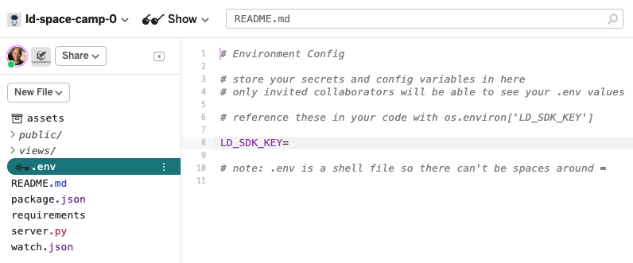

# Overview

This guide explains LaunchDarkly's flag **Targeting** features, including percentage rollouts, flag Insights, and segments. You can use these targeting features to create flags that serve different values to different users.

This guide covers:

- Concepts and terms that LaunchDarkly uses for targeting
- Adding user details to flag evaluation code
- Protecting Personally Identifiable Information (PII) when you create flags
- Examining users in the Users dashboard
- Rolling out flag variations to a percentage of users
- Targeting specific users with flag rules
- Seeing how flag evaluations change over time with flag Insights
- Targeting users by their attributes
- Preventing specific user details from being sent to LaunchDarkly

# Prerequisites

To complete this guide, you must have the following prerequisites:

* An active LaunchDarkly account with the ability to create a flag.
* Basic knowledge of the Python programming language. You use Python in the exercises in this guide.
* Access to [Glitch](https://glitch.com/about).
* You must have completed the exercises in [Your first flag](/guides/tutorials/first-flag). The exercises in this guide rely on apps and flags you create in that guide.
* The SDK key for the environment you created in [Your first flag](/guides/tutorials/first-flag).

<LearnMore>
  <LearnMoreLink to="https://glitch.com/create">How to use Glitch</LearnMoreLink>
</LearnMore>

# Concepts

In order to use this guide, you should understand the following concepts:

## User context

The user context is everything LaunchDarkly knows about a targeted endpoint. LaunchDarkly refers to all objects targeted by a flag as `users`. Not all users are human beings. A user might be a server, an IP address, or any other object that can be addressed.

The user context is composed of different attributes. An attribute is any identifier applied to an endpoint or user context.

<Callout intent="primary">
<CalloutTitle>Targeting users by attribute is a Pro and Enterprise feature</CalloutTitle>
<CalloutDescription>

Targeting users by attribute is available to customers on a Pro or Enterprise plan. To learn more, [read about our pricing](https://launchdarkly.com/pricing/). To upgrade your plan, [contact Sales](https://launchdarkly.com/contact-sales/).

</CalloutDescription>
</Callout>

Possible attributes include, but are not limited to:

* User ID
* Group membership
* Number range
* Location
* Prerequisites
* Version
* IP address
* Local browser time

There are also optional **standard** attributes that must conform to these requirements:

<Table>
  <TableHeader>
    <TableHeadCell>Attribute</TableHeadCell>
    <TableHeadCell>Requirements</TableHeadCell>
  </TableHeader>
  <TableBody>
    <TableRow>
      <TableCell>email</TableCell>
      <TableCell>Must be a string.</TableCell>
    </TableRow>
    <TableRow>
      <TableCell>firstName</TableCell>
      <TableCell>Must be a string.</TableCell>
    </TableRow>
    <TableRow>
      <TableCell>lastName</TableCell>
      <TableCell>Must be a string.</TableCell>
    </TableRow>
    <TableRow>
      <TableCell>name</TableCell>
      <TableCell>Must be a string.</TableCell>
    </TableRow>
    <TableRow>
      <TableCell>avatar</TableCell>
      <TableCell>Must be an absolute URL to an avatar image for the user.</TableCell>
    </TableRow>
    <TableRow>
      <TableCell>ip</TableCell>
      <TableCell>Must be an IP address.</TableCell>
    </TableRow>
    <TableRow>
      <TableCell>country</TableCell>
      <TableCell>Must be a string.</TableCell>
    </TableRow>
    <TableRow>
      <TableCell>anonymous</TableCell>
      <TableCell>
        Must be a boolean. This attribute prevents the user's other attributes from being transmitted to the events
        endpoint, and prevents the user from showing up on the dashboard.
      </TableCell>
    </TableRow>
    <TableRow>
      <TableCell></TableCell>
      <TableCell></TableCell>
    </TableRow>
  </TableBody>
</Table>

With LaunchDarkly, you can create user objects with as many attributes as you need. The only required attribute is the `key` attribute, which holds the user identifer. If the LaunchDarkly rules engine sees two user objects with the same `key`, it assumes they represent the same user.

When a user encounters a flag, their attributes are sent to LaunchDarkly. This makes the attributes available through the dashboard. All the user attributes are sent, with the exception of those that have been marked private.

## Flag variations

A flag variation is whatever action the flag enables that is not the flag's default behavior. Some flags are boolean, and only have `true` and `false` variations. Other flags have many more variations.

## Rule evaluation

Rule evaluation occurs when a LaunchDarkly client determines whether or not to show a flag variation to a user. The rule is how the decision is described in a human-readable way. For example, “Turn on a new feature for 10% of users” is a rule that targets 10% of users.

LaunchDarkly uses rule evaluation when it checks the rule against the user context of a particular destination. For example, LaunchDarkly could determine yes or no in response to the rule “Is this user in the 10% who get the new feature variation?"

Flags can have multiple rules. If multiple rules exist, LaunchDarkly evaluates them top to bottom based on the how the rules are configured in the flag's dashboard. You can drag and drop rules to change the evaluation order.

Most people write rules that have `AND` or `ONLY IF` statements, to refine the targeting.

For example:

- `IF` user is in `test_group`,
- `AND` user is using version 2.1 or above,
- show the user `flag variation 1`.

In that case, even if a user is in the `test_group`, they won’t see `flag variation 1` unless their version has been updated recently. If someone is on a new version but is not in the `test_group`, they also won’t see it. In this example, it doesn’t matter what order the rules are evaluated in.

## Flag targeting

In feature management, targeting is the ability to make a flag's different variations appear to different users, "targeting" users with specific versions of the flag. Each flag can have targeting rules that specify which users should receive which variations.

In LaunchDarkly, none of the targeting rules need to live in application code. They're all configured using the LaunchDarkly dashboard. Only the user needs to be implemented in your code. This prevents sensitive information from being transmitted with feature flag data.

## Identifying users

LaunchDarkly uses the user object's `key` attribute as the identifier for the user. This identifier can be any string of characters. It doesn't need to be in a particular format.

Be thoughtful about how you construct user identifiers in your app. The most important considerations are:

* **Uniqueness**: Each identifier should only be used for one user.
* **Consistency**: Each user should always have the same identifier.
* **Opacity**: Identifiers should not reveal any Personally Identifiable Information (PII) about the user, such as their name, location, or email address.

<Callout intent="warning">
<CalloutTitle>Protecting personally identifiable information (PII)</CalloutTitle>
<CalloutDescription>

A person's email address is a common form of identifying information. It's a good identifier because it's unique to the individual, and consistent. Email addresses rarely change. However, malicious third parties can easily trace an email address back to the human being who owns it. This makes an email address sensitive information, because it could be abused by a bad actor. The same is true for a person's phone number or home address.

Many countries, states and organizations have rules about handling PII. To ensure user privacy, don't store or use PII anywhere unless it's necessary.

If you must create user attributes that contain PII, mark the attribute as private so that it's not uploaded to LaunchDarkly. We'll discuss private attributes later in this guide.

</CalloutDescription>
</Callout>

# Exercise preparation

<Callout intent="alert">
<CalloutTitle>You must have completed prerequisites to do these exercises</CalloutTitle>
<CalloutDescription>

The exercises in this guide rely on the flags and SDK keys you created in the <a href="/guides/tutorials/first-flag">Your first flag</a> guide.<br/><br/> If you have not completed that guide, do so now and return to this section.

</CalloutDescription>
</Callout>

These exercises use a Python-based web application that we provide which runs on [Glitch](https://glitch.com/about), an online tool for creating web apps.

## Remixing the targeting lab app

You must remix the Glitch project embedded below to create an editable copy of the Python web app. **Remixing** is Glitch's term for cloning a project. This creates an editable copy of the Python web app we use for this exercise.

To remix the app, select this [Glitch remix link](https://glitch.com/edit/#!/remix/ld-space-camp-2), or follow the instructions below.

<iframe src="https://glitch.com/embed/#!/embed/ld-space-camp-2?path=README.md&previewSize=0&attributionHidden=true" title="ld-space-camp-0 on Glitch" allow="geolocation; microphone; camera; midi; vr; encrypted-media" width="100%" height="420px"></iframe>

To remix the app:

1. Click the fullscreen button in the bottom right-hand corner of the Glitch app embedded above.
app. The app opens in a separate tab.
2. In the new Glitch tab, click **Remix to Edit**.
3. The name of your project appears in the top left corner. If you want to rename the app, click the arrow next to the name.

<LearnMore>
  <LearnMoreLink to="https://glitch.com/create">How to use Glitch</LearnMoreLink>
</LearnMore>


### Switching between the code and app views in Glitch

In the Glitch app, you have the option to see the live app in production, or the code for the app.

To switch between them:

1. Navigate to the Glitch app you remixed.
2. At the top of the Glitch page, click **Show**:


3. Click **In a New Window**.
4. Confirm that you can switch between the code and the app view.

<Callout intent="alert">
<CalloutTitle>Issues when running the app next to the code</CalloutTitle>
<CalloutDescription>

Some users encounter issues when running the Glitch editor and app in the same window. These issues happen primarily when trying to use the app's "Log in" form. If the form isn't working, run the app in its own browser tab or window.

</CalloutDescription>
</Callout>

## Finding the LaunchDarkly SDK key in your project

During the exercises in the [Your first flag](/guides/tutorials/first-flag) guide, you created a LaunchDarkly project, and configured your app to use the SDK key from that project. This new app will use the same SDK key.

To retrieve the SDK key for your project:

1. Navigate to the [Account settings](https://app.launchdarkly.com/settings/projects) page. It lists all the projects to which your LaunchDarkly user account has access.
1. Find the project which you created for the <a href="/guides/tutorials/first-flag">Your first flag</a> guide.
1. In the **Account Settings** page, click on the project's SDK key to copy it to your clipboard:


## Configuring the LaunchDarkly SDK key in your app

1. Click the `.env` file in the Glitch sidebar.
2. Assign the **SDK key** you copied above to an environment variable called `LD_SDK_KEY`:

<CodeTabs
  defaultValue="env"
  values={[
    { label: '.env', value: 'env', },
  ]
}>

<CodeTabItem value="env">

```env
LD_SDK_KEY=<PASTE-YOUR-SDK-KEY-HERE>
```

</CodeTabItem>
</CodeTabs>





# Exercise: Targeting a flag

When you completed the exercises in [Your first flag](/guides/tutorials/first-flag), you created a flag named **Pricing Tier 3**.

This exercise references **Pricing Tier 3**'s Targeting page throughout the guide. Keep the Targeting page open to access it quickly.

To open the Targeting page:

1. Navigate to your LaunchDarkly project.
2. Find the **Pricing Tier 3** flag in your feature flag list.
2. Click the flag name. The flag's Targeting page appears.
3. Duplicate the flag's Targeting page in another browser tab or window.

## Finding the user object

In [Your first flag](/guides/tutorials/first-flag), you learned about the `variation()` method, which application code uses to evaluate flags.

`variation()` takes three arguments:

- The flag name
- The user object
- The default value

The user object in the example app code has two attributes: `key` and `anonymous`. Because the `variation()` call is always made with the same user `key`, LaunchDarkly assumes that there's only one user of this app, who never changes.

In the code for the Space Camp app, the user object is in the file named `server.py`, inside the `pricing()` function.

In the example below, the `anonymous` attribute set to `True`. When this happens, LaunchDarkly won't record any of this user's other attributes or list this user on the Users dashboard.

Here is an example:

<CodeTabs
  defaultValue="py"
  values={[
    { label: 'An anonymous user object', value: 'py', },
  ]
}>

<CodeTabItem value="py">

```py
# This page doesn't require a logged-in user,
# so tell LaunchDarkly that this is an anonymous user.
# The key is arbitrary and can be anything.
# To clarify that this is an anonymous
# user, it's named "anon".
user = {
  "key": "anon",
  "anonymous": True
}
```

</CodeTabItem>
</CodeTabs>

To learn more, read [Anonymous users](/home/users/anonymous-users).

## Logging in to the Glitch app

We'll create a user in LaunchDarkly to reference for this exercise. To do this, log in to the Space Camp app with an email address.

To log in:

1. Navigate to the app view of your Glitch app.
2. Click the "Log in" link in the top right of the app's front page:


3. Enter an email address in the email address field. Any email address works. You are redirected to the main page.
4. Click the user avatar in the top right-hand corner. The log in menu appears.


5.  Click **Log out**.

The email address you just logged in with was registered as a user in LaunchDarkly.

## Creating a user key with a hashed email address

The Space Camp app uses email addresses as user IDs. Providing the user's email addresses as the `key` in our user object means that LaunchDarkly stores that email address. We do not recommend this approach for production environments.

For purposes of this guide exercise, there is no other unique, consistent identifier for users, because this exercise collects very limited user data.

To protect the email addresses, you can use the common programming technique known as **hashing**. When you hash something, you apply an algorithm to obscure the true value of the email address by translating letters and numbers in it into other characters. This process is almost impossible to reverse, so email addresses you store using this method are protected.

Python includes several popular hashing algorithms in its standard library. Use the SHA256 algorithm to convert the user's email address into a meaningless but unique hash which can be used as the user `key`.

To hash the email address:

1. Add Python's hashing module, `hashlib`, to the list of included modules right at the top of `server.py`:

<CodeTabs
  defaultValue="py"
  values={[
    { label: 'Loading the hashing module', value: 'py', },
  ]
}>

<CodeTabItem value="py">

```py
import hashlib
import os
from flask import Flask, render_template, session, request, flash, redirect, url_for
```

</CodeTabItem>
</CodeTabs>

2.  Add the `user_object_from_email()` function under the `pricing()` function. The code that generates a hash has its own function, `user_object_from_email()`, which takes an email address and returns a user object as a Python `dict`:

<CodeTabs
  defaultValue="py"
  values={[
    { label: 'Creating the user object with a hashed email address', value: 'py', },
  ]
}>

<CodeTabItem value="py">

```py
def user_object_from_email(email):
    ## Hash the email address using the SHA256 algorithm
    email_hash = hashlib.sha256(email.encode())
    ## Output the hash as hexadecimal and truncate to 10 characters long
    email_hash_hex = email_hash.hexdigest()[:10]
    ## Identify user by their hashed email address
    return {
      "key": email_hash_hex
    }
```
</CodeTabItem>
</CodeTabs>

3. Navigate to `pricing()` and find the user object:

<CodeTabs
  defaultValue="py"
  values={[
    { label: 'The anonymous user object', value: 'py', },
  ]
}>

<CodeTabItem value="py">

```py
# Since this page doesn't require a logged-in user,
# tell LaunchDarkly that this is an anonymous user for now.
# The key is arbitrary and can be anything you want.
# Here, we wanted to be clear that this was an anonymous
# user, so the key is set to "anon".
user = {
  "key": "anon",
  "anonymous": True
}
```

</CodeTabItem>
</CodeTabs>

4. When the user is logged in, you should send a new user object from the `user_object_from_email()` function, instead of the old user object.

 Replace the lines above with this code, which chooses which user object to use by checking if there's a logged-in user session with an email address:

<CodeTabs
  defaultValue="py"
  values={[
    { label: 'Generate a new user object or use the anonymous one', value: 'py', },
  ]
}>

<CodeTabItem value="py">

```py
if (email):
  user = user_object_from_email(email)
else:
  ## Since the user isn't logged in,
  ## let's tell LD that this is an anonymous user.
  user = {
    "key": "anon",
    "anonymous": True
  }
```

</CodeTabItem>
</CodeTabs>

5. Modify this version of the app so you can see the hash that's been generated from the email address. To do this, add an extra `key` parameter to the `render_template()` call at the end of `pricing()`:

<CodeTabs
  defaultValue="py"
  values={[
    { label: 'Send both the email and the hash to the template', value: 'py', },
  ]
}>

<CodeTabItem value="py">

```py
    return render_template(
      'pricing.html',
      is_tier_3_enabled=is_tier_3_enabled,
      email=email,
      key=user['key']
    )
```

</CodeTabItem>
</CodeTabs>

The whole `pricing()` function should now look like this:

<CodeTabs
  defaultValue="py"
  values={[
    { label: 'The pricing() function', value: 'py', },
  ]
}>

<CodeTabItem value="py">

```py
@app.route('/')
def pricing():
    """Displays the pricing page."""
    ## Fetch the user's email address. If they aren't logged in,
    ## the stored value will be None.
    email = session.get("email")
    if (email):
      user = user_object_from_email(email)
    else:
      ## Since the user isn't logged in,
      ## let's tell LD that this is an anonymous user.
      user = {
        "key": "anon",
        "anonymous": True
      }
    is_tier_3_enabled = ld_client.variation('pricing-tier-3', user, False)
    return render_template(
      'pricing.html',
      is_tier_3_enabled=is_tier_3_enabled,
      email=email,
      key=user['key']
    )
```

</CodeTabItem>
</CodeTabs>

To verify everything is working correctly, use this procedure to check your work:

1. Navigate to Glitch's left sidebar and click into the `views` folder.
2. Open `avatar.html`. This is the template for the clickable avatar and its drop-down menu.
3. Find the two lines that show the user's email in the menu:

<CodeTabs
  defaultValue="html"
  values={[
    { label: 'The HTML to display the user email', value: 'html', },
  ]
}>

<CodeTabItem value="html">

```html
<span class="dropdown-item disabled">{{ email }}</span>
<div class="dropdown-divider"></div>
```

</CodeTabItem>
</CodeTabs>

4. Copy those two lines and add them immediately below the previous two, then change `email` to `key`:

<CodeTabs
  defaultValue="html"
  values={[
    { label: 'The HTML to display the user email', value: 'html', },
  ]
}>

<CodeTabItem value="html">

```html
<span class="dropdown-item disabled">{{ email }}</span>
<div class="dropdown-divider"></div>
<span class="dropdown-item disabled">{{ key }}</span>
<div class="dropdown-divider"></div>
```

</CodeTabItem>
</CodeTabs>

5. Navigate to your Glitch app.
6. Click on the avatar in the top right corner. If everything is working correctly, you should see both the email and the hash:


## Adding more users to LaunchDarkly

After you verify you've configured a user correctly, log in to the Glitch app a few times using different email addresses.

You can use random values for the email address, such as `test1@email.com`. When you log in, refresh the page to view the front page of the app.

Each time you view the front page as a logged-in user, LaunchDarkly records that user ID.

After you've logged in using four or five different email addresses, look at the users that have been collected by LaunchDarkly in the Users dashboard.

# Accessing the Users dashboard

The Users dashboard displays all users who have been included in user objects so far. Access the Users dashboard in the left-hand navigation of your LaunchDarkly project.

To learn more, read [The Users dashboard](/home/users/users-dashboard).

The Users dashboard lists all the users for whom flags have been evaluated in this particular environment and project.

Here is an image of the Users dashboard:


Click on a user's `key` attribute to look at an individual user page. The left side displays all the attributes which have been uploaded to LaunchDarkly so far. On the right you can see how each flag in the project will evaluate for that particular user.

You'll probably see that there are not many users yet. As you continue this guide, you'll add more users to test with.

# Configuring a percentage rollout

A percentage rollout is when you choose a percentage of users to see each variation of your flag. You can increase or decrease these percentages over time.

To learn more, read [Targeting users](/home/flags/targeting-users).

To turn on a percentage rollout for the `Pricing Tier 3` flag:

1. Navigate to LaunchDarkly.
2. In the **Feature Flag** list, click **Pricing Tier 3**. The flag's **Targeting** page appears.
3. Find the **Default rule**, which is the flag variation that appears when targeting is enabled. In this case, it is set to `true`:


2. Click the dropdown.
  You'll see the choice of three different options:
  - `true`
  - `false`
  - `a percentage rollout`

3. Choose the percentage rollout. A slider will appear above the variations:


4. Click to drag the slider to the right. As it moves, the percentages allocated to each variation change. You can also edit the percentage numbers directly instead of moving the slider.
5. Set the `true` variation to 30%.
6. Confirm that the flag's **Targeting** toggle is set to **on**.
7. Click **Save Changes**.
8. Log in to the Space Camp app as a few different users. Keep track of which email addresses you use as you log in and log out.
9. When the third pricing tier appears, you know the user you logged in as is part of the 30% of users targeted by the **Pricing Tier 3** flag.
10. Log out and log back in again as that same user. The third pricing tier appears every time that user logs in, because LaunchDarkly can now identify individual users. That user will always see the third tier until the flag's targeting changes.
11. When you find a user who doesn't see the third tier, save their email address.

Now you've seen flag targeting in action. Let's move on to verifying that the flag is working as you intended.

# Verifying flag behavior with flag Insights

You can confirm that the **Pricing Tier 3** flag is appearing for 30% of users. LaunchDarkly offers analytics tools to help you confirm that your flags are behaving the way you want them to.

1. Navigate to the **Pricing Tier 3** flag's dashboard and click on the **Insights** tab:


2. Choose **Last 60 minutes** to zoom in on recent activity.

 This graph shows all the times this flag has been evaluated in the last hour. It also shows the variations that were shown to users.

 As you've changed how the flag is targeted, the data changes with it. Since you changed the flag's targeting to a percentage rollout, you should see that roughly a third of flag evaluations have been `true`, while the rest have been `false`.

<Callout intent="alert">
<CalloutTitle>Waiting for Insights data</CalloutTitle>
<CalloutDescription>

It can take a couple of minutes for the Insights graph to process and display the latest data. If you reload the page, be sure to check that the time range button still reads <strong>Last 60 minutes</strong>.

If it shows an absolute time range instead, such as "10:35 AM - 11:35 AM", change it back to <strong>Last 60 minutes</strong>.

</CalloutDescription>
</Callout>

Percentage rollouts give you broad control over the flag variation different users see. You can exercise much finer control too.

# Targeting individual users

You can override the percentage rollout for any particular user, forcing them to see or not see a flag regardless of other targeting rules. You can do this by targeting them with rules individually.

In [Configuring a percentage rollout](#configuring-a-percentage-rollout), you saved the email address of a user who did not see the new pricing option in your Glitch app. You need that email address for this exercise, so find it now.

Do this through the Users dashboard:

1. Log in to your Glitch app with the email address of the user who did **not** see the **Pricing Tier 3** flag.
2. Click on the avatar icon in the top-right of the page. The 10-character hashed user `key` is displayed. Copy this key and save it.
3. Navigate to LaunchDarkly and click into the **Users** dashboard.
4. Find the user `key` you saved in the list of users and click on it. The user's menu appears.
5. Change the flag setting for the **Pricing Tier 3** flag from `false` to `true`.
6. A targeting circle appears next to the selector. This indicates that are adding analysis explicit targeting rule for this user.
7. Click the green **Save Changes** button:


8. Click the **Pricing Tier 3** link to go straight to the flag's **Targeting** page. The **Target individual users** section has expanded. This section specifies the individual users who should always see a particular flag variation. In the `true` section, you see the key for the user whose setting you just changed:


9. Log back into the Space Camp app as that user and refresh the page. The third pricing tier should now be visible.

# Targeting users by attribute

Targeting individual users can take a long time if you wish to add entire groups to a flag. If you do not want to target one user at a time, you can configure LaunchDarkly to show a flag to every user with a certain attribute.

Let's pretend that you only want to show the option for tier 3 pricing to users whose email addresses begin with the letter `A`. The **Pricing Tier 3** flag should evaluate to `true` only for those users.

To evaluate flags based on specific user criteria, you must create a targeting rule. You can create a rule about any user attribute.

However, in our current example, we can't use a rule to look at the first letter of the user's email address. Only the hashed version of the email is stored, which looks nothing like the real email address.

There are several ways around this problem. You can use a **custom attribute** or a **private attribute** to configure the targeting behavior how you want.

# Configuring custom attributes

You can create and add your own attributes to user objects. These are known as **custom attributes**. The values of these attributes can be numbers, strings, or even lists. Place these attributes within a sub-dictionary of your user object named `custom`.

At this point, the user object only has one attrubute: `key`. Add another attribute to hold the first letter of the user's email address.

To add this attribute:

1. Navigate to your Glitch app.
2. Open `server.py`.
3. Modify the `dict` returned at the end of the `user_object_from_email` function:

<CodeTabs
  defaultValue="py"
  values={[
    { label: 'Add the firstLetter attribute to the user object', value: 'py', },
  ]
}>

<CodeTabItem value="py">

```py
return {
  "key": email_hash_hex,   ## don't forget the comma!
  "custom": {
    "firstLetter": email[0]
  }
}
```

</CodeTabItem>
</CodeTabs>

4. Log in to the Space Camp app a couple more times, so that you send examples of this new attribute to LaunchDarkly.
5. Navigate to LaunchDarkly.
6. Find **Pricing Tier 3** and click into its targeting page.
7. Find the section titled **Target users who match these rules**:


8. Click  **+ Add Rules**. A form for adding a rule appears:


9. The first field in the form is where you choose the attribute to match. Click and scroll down to find `firstLetter.`
10. Click the middle field and choose "is one of". For the targeting rule to succeed, the value of `firstLetter` must match one of the two options you just entered.
11. In the third field, enter both the upper and lower case letter `A` as values. Here's how:
    - Click the third field to focus it.
    - Type a lower-case `a`. A suggestion appears: `Create option "a"`.
    - Press `Enter`. The letter `a` becomes an attribute.
    - Type an upper-case `A` and press `Enter`. Each of the two letters should be in its own option box, like this:


12. Click the fourth field and choose the `true` variation. Now when the rule matches a user object, the `true` variation appears.
13. In the **Default Rule** section, choose `false`. This ensures that only users who match our rules receive a `true` evaluation:


14. Click **Save Changes**.

You can test your new targeting rule by logging in to your Glitch app with email addresses starting with the letter `a`, and addresses that start with other letters.

Alternatively, you can also use a private attribute to target groups of users.

### Configuring private attributes

You can use **private attributes** to target users without sending PII to LaunchDarkly.

Instead of creating the `firstLetter` custom attribute, we can put the whole email address in the `email` attribute and use it in a targeting rule. To ensure that this attribute isn't uploaded, we will designate it as `private`.

There are three different ways to mark attributes private:

- You can mark all attributes private globally in the `LDClient` configuration object. This indicator does not apply to the user's `key`, since LaunchDarkly needs the key to determine flag targeting.
- You can mark specific attributes private by name globally in the `LDClient` configuration object.
- You can mark specific attributes private by name for individual users when you construct user objects.

In this guide we won't mark all attributes private, because we may want to use non-private attributes later.

This leaves two options to create a private attribute:

* when `ldclient` is configured, or
* when the user object is created.

To ensure that the `email` attribute is never accidentally uploaded, change the `ldclient` configuration to mark that attribute as private.

To do this:

1. Navigate to your Glitch app.
2. Open `server.py`.
3. Find the line near the top of `server.py` which starts with `ldclient.set_sdk_key` and add this `ldclient.set_config` command before it:

<CodeTabs
  defaultValue="py"
  values={[
    { label: 'Add an extra line of configuration', value: 'py', },
  ]
}>

<CodeTabItem value="py">

```py
ldclient.set_config(ldclient.Config(private_attribute_names=['email']))
ldclient.set_sdk_key(os.getenv('LD_SDK_KEY')) ## Set your SDK key in .env
```

</CodeTabItem>
</CodeTabs>


4. In the `user_object_from_email()` function, delete the `custom` attributes section from the user object.
5. In its place, add a single `email` attribute:

<CodeTabs
  defaultValue="py"
  values={[
    { label: 'Change the user object', value: 'py', },
  ]
}>

<CodeTabItem value="py">

```py
return {
  "key": email_hash_hex,
  "email": email
}
```

</CodeTabItem>
</CodeTabs>

Now change the existing targeting rule in the LaunchDarkly dashboard:

1. Navigate to LaunchDarkly.
2. Find **Pricing Tier 3** and click into its targeting page.
3. Find the section titled **Target users who match these rules**:
4. Change the value in the first field from `firstLetter` to `email`.
5. Change the operator selector from `is one of` to `starts with`. You don't need to change the third field, because we're still looking for an `A` or `a`.
6. Click **Save Changes**.

At the end, the rule should look like this:


You can test your new targeting rule by logging in to your Glitch app with email addresses starting with the letter `a`, and addresses that start with other letters. It should only show the third pricing tier to users whose email address begins with the letter `A`.

You can verify that none of the users' email addresses have been sent to LaunchDarkly. Return to the Users dashboard, and look at the **Email** column in the list of users. The whole column should be blank.

# Conclusion

In this tutorial, you have learned to:
- target a rule to individuals or by attribute
- mark attributes as private
- execute a percentage-based rollout
- use the dashboard to understand rule evaluation and how it changes over time.

We hope that this has helped you understand how precisely you can target flag delivery and how you can configure targeting to return only the information you want.

<Callout intent="primary">
  <CalloutTitle>Want to know more? Start a trial.</CalloutTitle>
  <CalloutDescription>

Your 14-day trial begins as soon as you sign up. Learn to use LaunchDarkly with the app's built-in quick start guide. You'll see how easy it is to manage the whole feature lifecycle from concept to launch to control.<br/><br/>

Want to try it out? [Start a trial](https://launchdarkly.com/start-trial/).

  </CalloutDescription>
</Callout>
