## Overview

This topic explains how to create and implement custom roles and policies in LaunchDarkly.

Custom roles are very flexible. You can create a custom role with broad or precise permissions and apply it to one or more members in your team.

To configure a custom role:

1. [Create a custom role](#creating-a-custom-role)
2. [Create one or more policies for that custom role](#creating-policies-for-roles-and-resources)
3. [Give one or more team members to that custom role](#giving-a-member-a-custom-role)

## Creating a custom role

Before you can give a team member custom permissions in LaunchDarkly, you must create a custom role to give them.

To create a custom role:

1. Navigate to **Account Settings**.
2. Click into the **Roles** tab.
3. Click **New Role**. The "Create a role" screen appears.
4. Enter a human-readable **Name** for the role.
5. Enter a **Key** for the role.
6. (Optional) Enter a **Description** to explain what the role does.
7. (Optional) Create a policy in the "Policy" fields.
8. Click **Save Role**.

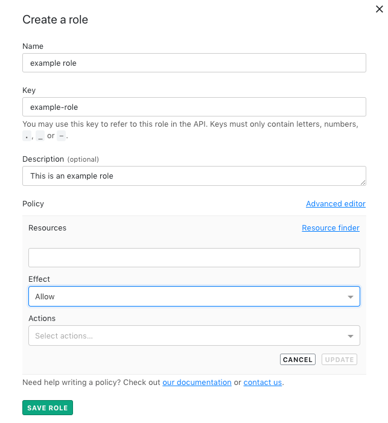

## Editing existing custom roles

Edit an existing policy at any time by clicking the **pencil icon** or add a new policy by clicking **Add statement**.

To edit a custom role:

1. Navigate to **Account Settings**.
2. Click into the **Roles** tab and find the role you wish to edit.
3. Click **Edit**. The "Edit [your role's name]" screen appears.

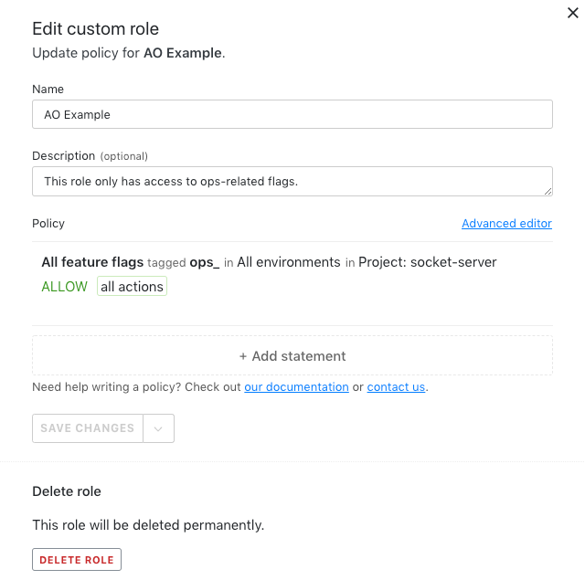

4. Change whatever features of the role you wish.
5. Click **Save.**

## Deleting custom roles

Delete a custom role from the Account Settings page.

To delete a custom role:

1. Navigate to **Account Settings**.
2. Click into the **Roles** tab and find the role you wish to edit.
3. Click **Edit**. The "Edit [your role's name]" screen appears.
4. Click **Delete Role**.

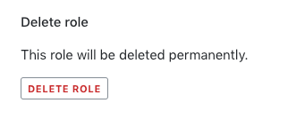

## Creating policies for roles and resources

Policies are sets of actions a custom role is allowed or not allowed to take. You can create policies from the **Roles** tab.

<Callout intent="info">
  <CalloutTitle>Write policies by hand in the Advanced editor</CalloutTitle>
  <CalloutDescription>

Advanced users can write custom policies of their own with the Advanced editor. To learn more about writing your own
policies, read [Policies in custom roles](/home/account-security/custom-roles/policies).

  </CalloutDescription>
</Callout>

To create a policy:

1. Complete the steps in [Creating a custom role](#creating-a-custom-role).
2. In the "Create a role" screen, click into the **Resources** field.
3. Specify a resource this policy affects.

<Callout intent="info">
  <CalloutTitle>The Resource Finder can help</CalloutTitle>
  <CalloutDescription>

Click **Resource finder** to choose projects, feature flags, environments, metrics, and roles to add to your policy.

  </CalloutDescription>
</Callout>

4. Choose an **Effect** from the dropdown.
5. Choose one or more **Actions** for the policy to enforce.

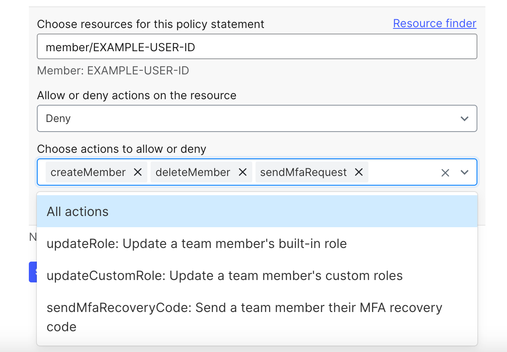

6. Click **Update**. The results of your policy display.

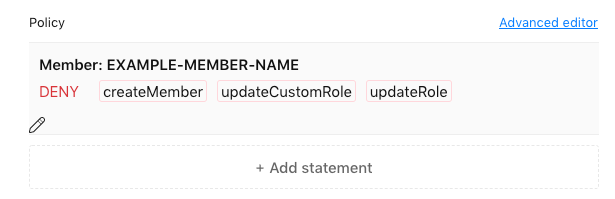

## Giving a member a custom role

After you have created a custom role and policies for it, you must give that role to all members to whom you wish it to apply.

To give a member a custom role:

1. Navigate to **Account Settings**.
2. Click into the **Team** tab and find the team member you wish to give a custom role.
3. Click **Edit** beside that team member's name. The member's Settings page opens.

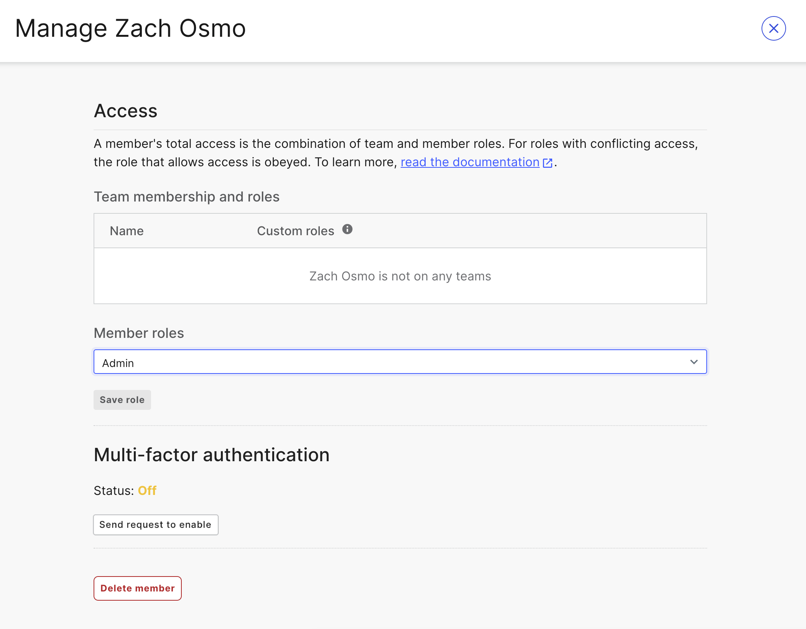

4. Click the member's **Role**. A dropdown menu expands.

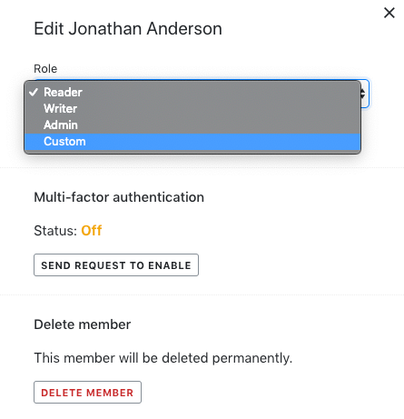

5. Choose **Custom** from the dropdown. All available custom roles appear with checkboxes beside them.
6. Choose all custom roles you wish to give the member.
7. Click **Save Member**.

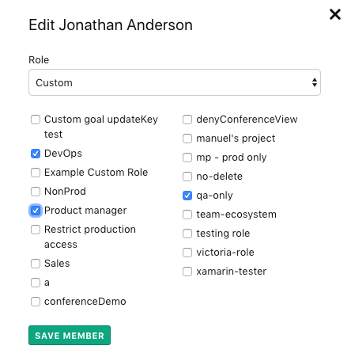

<Callout intent="alert">
  <CalloutTitle>Add members individually</CalloutTitle>
  <CalloutDescription>

You must add a custom role to one member at a time. You may not apply a role to multiple members simultaneously.

For example, if you wish to add a role for the QA team, you must find each QA team member and add the role to each member individually.

  </CalloutDescription>
</Callout>

## Viewing custom role details

You can see details about a specific custom role by clicking the role where it appears in the LaunchDarkly UI. More information is available on the "Role policy details" screen.

To view details for custom roles from the **Roles** tab:

1. Navigate to **Account Settings** and click into the **Roles** tab.
2. Find the role with details you wish to view and click **Details**. The "Role policy details" screen appears.

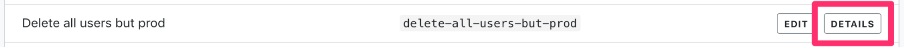

To view details for custom roles from other parts of the LaunchDarkly UI, click a custom role's name to open the "Role policy details" screen.

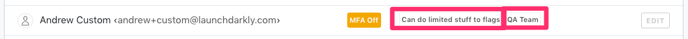

Use the "Role policy details" screen to view detailed information about a custom role, including which projects and feature flags the role has permission to modify. You can also see each action the custom role can perform and what that action does.
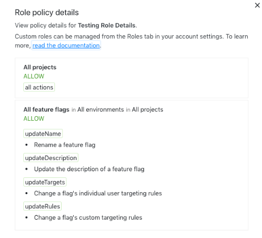

<Callout intent="info">
  <CalloutTitle>"Role policy details" is for custom roles only</CalloutTitle>
  <CalloutDescription>

The "Role policy details" screen is only available for custom roles. It won't open if you click on a default
`reader`, `writer`, or `admin` role.

  </CalloutDescription>
</Callout>

## Removing a custom role from a member

If a team member changes function or needs their permissions modified, you can remove a custom role from them at any time.

To remove a custom role from a member:

1. Navigate to **Account Settings**.
2. Click into the **Team** tab and find the team member you wish to remove a custom role from.
3. Click **Edit** beside that team member's name. The member's Settings page opens.
4. Deselect the checkboxes for the roles you wish to remove from the member.
5. (Optional) If you wish to return the member to a standard role, choose **Reader**, **Writer**, or **Admin / Owner** from the **Role** dropdown.

6. Click **Save Member**.
