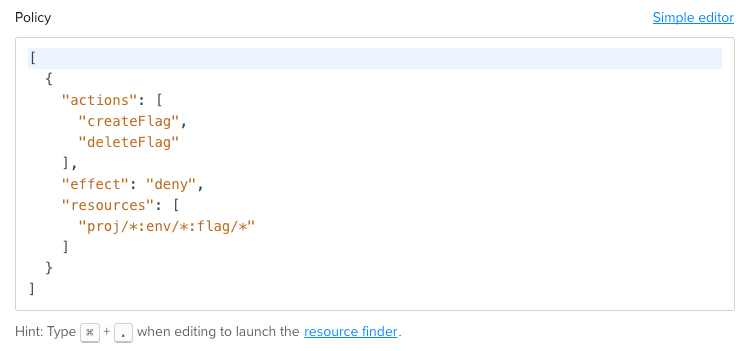
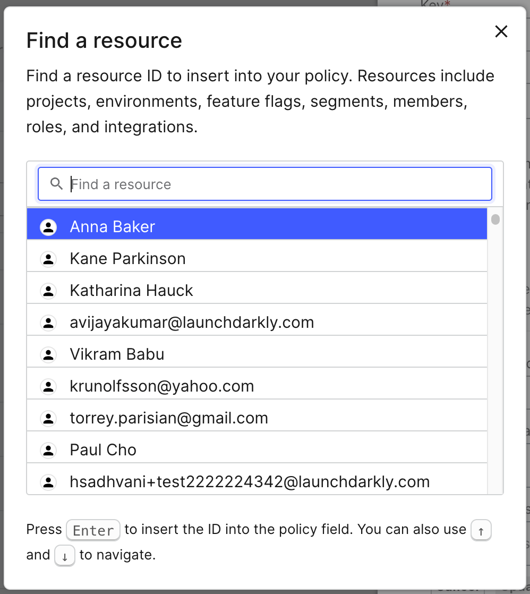

## Overview

This topic explains how policies work in custom roles. Policies combine resources and actions into a set of statements that define what users can or cannot do in LaunchDarkly.

## Understanding policies

Policies are represented as JSON arrays.

Each element in the array is a statement represented as a JSON object with three attributes:

<Table>
  <TableHeader>
    <TableHeadCell>Attribute name</TableHeadCell>
    <TableHeadCell>Description</TableHeadCell>
  </TableHeader>
  <TableBody>
    <TableRow>
      <TableCell>
        <code>effect</code>
      </TableCell>
      <TableCell>Either "allow" or "deny."</TableCell>
    </TableRow>
    <TableRow>
      <TableCell>
        <code>resources / notResources</code>
      </TableCell>
      <TableCell>
        A list of resource specifiers defining the resources to which the statement applies or does not apply.
      </TableCell>
    </TableRow>
    <TableRow>
      <TableCell>
        <code>actions / notActions</code>
      </TableCell>
      <TableCell>
        A list of action specifiers defining the actions to which the statement applies or does not apply.
      </TableCell>
    </TableRow>
  </TableBody>
</Table>
<Callout intent="info">
  <CalloutTitle>Inverse resource and action sets</CalloutTitle>
  <CalloutDescription>

If you would like to create a statement using `notActions` or `notResources`, you must do so in the advanced editor.
To learn more about the advanced editor, read [Writing policies in the advanced
editor](#writing-policies-in-the-advanced-editor).

  </CalloutDescription>
</Callout>

Here's an example statement:


<CodeTabs
  defaultValue="json"
  values={[
    { label: 'Statement', value: 'json', },
  ]
}>

<CodeTabItem value="json">

```json
  {
    "effect": "deny",
    "resources": [
      "proj/*:env/production:flag/*"
    ],
    "actions": [
      "*"
    ]
  }
```

</CodeTabItem>
</CodeTabs>

If the environment ID `production` represents the account's Production environment, this statement will deny the user from modifying any feature flags in production. You can also name an "inverse" set of resources by using `notResources` in a statement:

<CodeTabs
  defaultValue="json"
  values={[
    { label: 'notResources statement', value: 'json', },
  ]
}>

<CodeTabItem value="json">

```json
  {
    "effect": "allow",
    "notResources": [
      "proj/*:env/production:flag/*"
    ],
    "actions": [
      "*"
    ]
  }
```

</CodeTabItem>
</CodeTabs>

This statement explicitly allows all actions to feature flags across all environments _except_ the production environment.

## Policy Algorithm

The algorithm for determining whether access is allowed or denied by a policy is as follows:

- If any statement in the policy explicitly denies access to a resource and action, access is denied
- If a statement in the policy explicitly allows access to a resource and action, and no statement denies access, access is allowed

This means that statement order does not matter.

Note that users can be members of multiple custom roles, and each custom role has its own policy. If any custom role allows access, then access is allowed. This means that adding roles to a user can only increase that user's access.

## Writing policies in the Advanced Editor

The LaunchDarkly UI has a structured series of fields you can use to create policies.

To learn more about creating policies with the UI, read [Configuring custom roles](/home/account-security/custom-roles).

If you want to write a policy by hand, however, you can use the Advanced Editor.

To access the Advanced Editor:

1. Navigate to **Account Settings**.
2. Click into the **Roles** tab.
3. Click **New Role**. The "Create a role" screen appears.
4. Click **Advanced editor**. The Advanced Editor opens.



<Callout intent="alert">
  <CalloutTitle>Note: Resources are case-sensitive</CalloutTitle>
  <CalloutDescription>

When constructing your policy by hand with the advanced editor, make sure to use the resource key, which is case
sensitive. If the Production environment of your default project has the key `production` then
`proj/default:env/Production` will not work to allow actions to be taken in your default project's production
environment.

  </CalloutDescription>
</Callout>

## Finding resource IDs

You can find resource IDs with the resource finder, which can be accessed via the “resource finder” link in either the simple or advanced editor, or using the keyboard shortcut `⌘` + `.` (Mac) or `ctl` + `.` (Windows). All of your environments, members, feature flags, metrics, and roles will be available.


