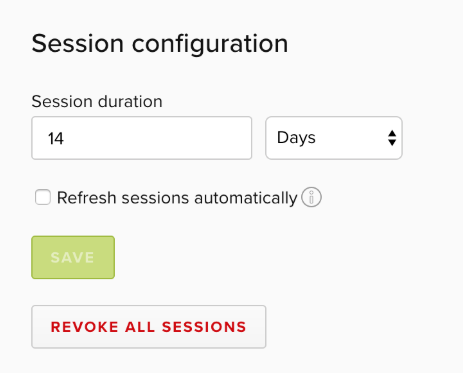

# Managing sessions

<Metadata timeToRead={props.timeToRead} lastModifiedDateFormatted={props.lastModifiedDateFormatted} />

## Overview

This topic explains how session duration settings work in LaunchDarkly, and how to configure them based on your security policies. Session duration specifies how long a user stays logged in to their account without visiting LaunchDarkly.

LaunchDarkly offers administrators a set of controls to manage how long users stay logged in to their account, and how often they need to re-authenticate. You can also reset sessions for everyone in your organization, forcing them to re-authenticate the next time they access LaunchDarkly.

## Configuring session length

Session timeout controls are in the [Security](https://app.launchdarkly.com/settings/#security) tab, in the **Session configuration** section.

To change session length:

1. Navigate to the **Account Settings** page.
2. Click into the **Security** tab and scroll to the **Session configuration** section.

3. Enter a number and choose a unit for the session length.
4. (Optional) Click the **Refresh sessions automatically** checkbox to reset the session start time every time a user accesses LaunchDarkly.
5. Click **Save**.

## Revoking all sessions

You can force all the members of an organization to re-authenticate by clicking one button in the Security tab.

To reset all sessions:

1. Navigate to the **Account Settings** page.
2. Click into the **Security** tab and scroll to the **Session configuration** section.
3. Click **Revoke all sessions**.

   <Callout intent="alert">
     <CalloutTitle>Resetting all sessions also resets yours</CalloutTitle>
     <CalloutDescription>
       If you reset all sessions for your organization's users, your session will also be reset. You will log out and
       and have to re-authenticate.
     </CalloutDescription>
   </Callout>
