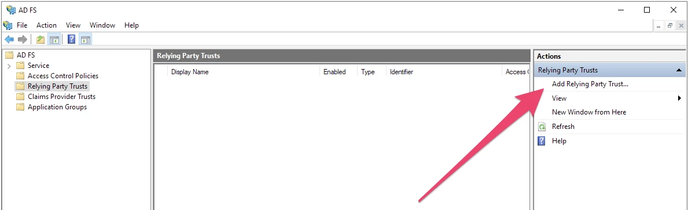
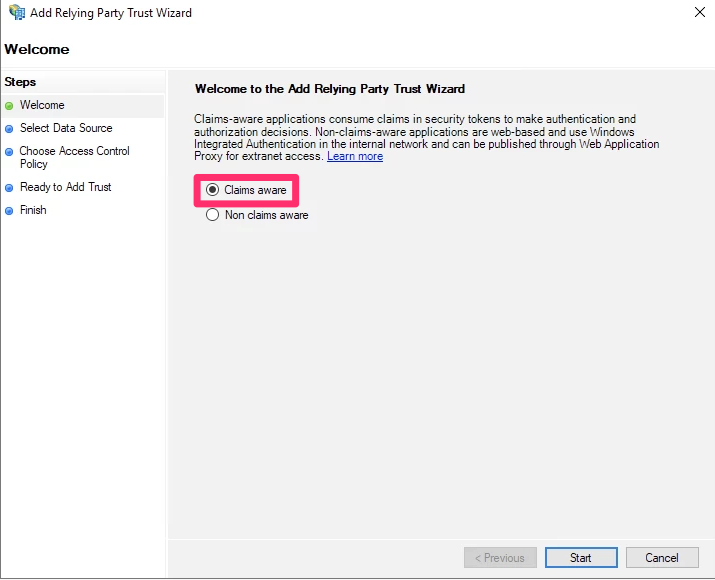

## Overview

This topic explains how to configure SSO integration between a self-hosted Active Directory Federation Services (ADFS) server and LaunchDarkly.

ADFS is a service provided by Microsoft as a standard role for Windows Server. It provides a web login using existing Active Directory credentials.

<Callout intent="info">
  <CalloutTitle>Troubleshooting ADFS-based SSO</CalloutTitle>
  <CalloutDescription>
    If you need information about ADFS errors during configuration, troubleshoot it by accessing the ADFS logs in the
    Windows Event Viewer.
  </CalloutDescription>
</Callout>

## Prerequisites

To give your team access to LaunchDarkly through ADFS, you need the following components:

- An Enterprise LaunchDarkly account.
- A signed SSL certificate.
- An Active Directory instance where all users have an email address attribute.
- A Microsoft Server instance with ADFS installed and configured.

  <Callout intent="alert">
    <CalloutTitle>Setting up ADFS</CalloutTitle>
    <CalloutDescription>

  This topic will not tell you how to set up ADFS. To learn more about setting up ADFS, read [Microsoft's
  documentation](
  https://docs.microsoft.com/en-us/previous-versions/dynamicscrm-2016/deployment-administrators-guide/gg188612)

    </CalloutDescription>
  </Callout>

## Set Up LaunchDarkly

For more information on configuring LaunchDarkly's SSO, read [Single sign-on](/home/account-security/sso).

<Table>
  <TableHeader>
    <TableHeadCell>LaunchDarkly field</TableHeadCell>
    <TableHeadCell>Notes</TableHeadCell>
  </TableHeader>
  <TableBody>
    <TableRow>
      <TableCell>Sign-on URL</TableCell>
      <TableCell>
        Copy the Token Signing certificate to a Base-64 encoded x.509 file and import it into LaunchDarkly
      </TableCell>
    </TableRow>
    <TableRow>
      <TableCell>X.509 certificate</TableCell>
      <TableCell>
        Default value: <code>https://YOUR-DOMAIN/adfs/ls/</code>.  
        If the default value fails, confirm that the endpoint is enabled and the URL path is correct.
         
        Find the endpoint in Service > Endpoints Search for an endpoint with the <code>
          SAML 2.0/WS-Federation
        </code> type.
      </TableCell>
    </TableRow>
  </TableBody>
</Table>

## Set Up Relaying Party Trust

1. Log into ADFS Management tool.
2. Click **Add Relying Party Trust...** to open the "Add Relying Party Trust Wizard".

3. Click **Start** to begin. Keep the default value, which is **Claims aware**.

4. Choose **Enter data about the relying party manually** and click **Next**.

![The Select Data Source screen.}(../../../../images/adfs-qizard-enter-data-manually.png)

5. Set the display name. You can enter any name you want and click **Next**.
6. Click **Next** on the following screen. You do not need to choose a certificate.
7. Select **Enable support for the SAML 2.0 WebSSO protocol**.
8. Enter the **Assertion consumer service URL** from the SSO section of LaunchDarkly into the **Relying party SAML 2.0 SSO service URL** field and click **Next**.
9. In the **Relying party trust identifier** field, enter `app.launchdarkly.com` and click **Add** and click **Next**.
10. Click **Next**. You do not need to change any access control policies.
11. Review your changes and click **Next**.
12. If you are satisfied with the configuration, click **Close**.

After you have successfully completed this procedure, a new LaunchDarkly trust will appear in the ADFS Management tool.

## Set Up Claim issuance Policy

1. Log into the ADFS Management tool
2. Select the **LaunchDarkly Trust**
3. Click **Edit Claim Issuance Policy...** in the dropdown. The **Edit Claim Issuance Policy** window opens.
4. Click **Add Rule**.
5. Set **Claim rule template** to **Transform an Incoming Claim** and click **Next**.

<Callout intent="alert">
  <CalloutTitle>Configure the User's UPN Correctly</CalloutTitle>
  <CalloutDescription>
    In the following example, we use the user's UPN as their name ID. As a best practice, we recommend setting the
    user's UPN to their email address instead.",
  </CalloutDescription>
</Callout>

6. Set the following options:

- Claim rule name: Enter a human-readable name. In this example, we use `UPN to NameID`.
- Incoming claim type: **UPN**
- Outgoing claim type: **Name ID**
- Outgoing name ID format: **Email**

7. Select **Pass through all claim values** and click **Finish**.

After you have successfully completed this procedure, ADFS will be configured with LaunchDarkly.

## Test Drive and Enable

After you successfully complete the procedures in this topic, you can log in through ADFS when test drive is enabled. For more information about test drive, read [Test drive mode](/home/account-security/sso#test-drive-mode).

If you are able to successfully log in with test drive enabled, you can enable SSO fully. For more information about enabling SSO, read [Enabling SSO](/home/account-security/sso#enabling-sso) .
