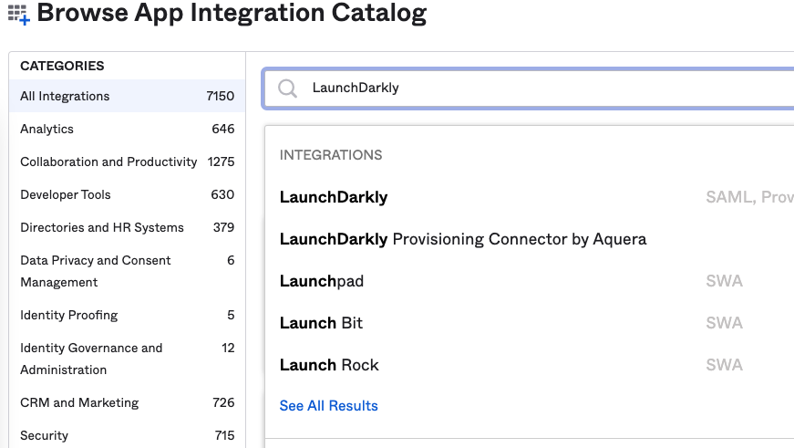
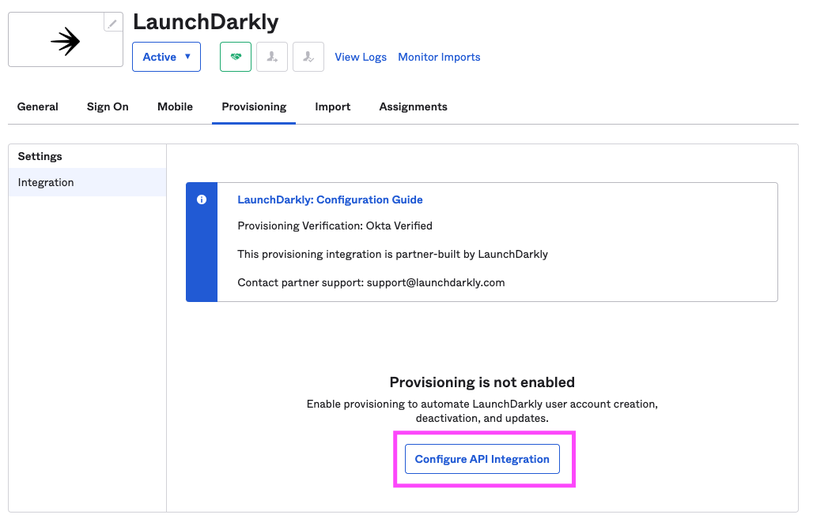
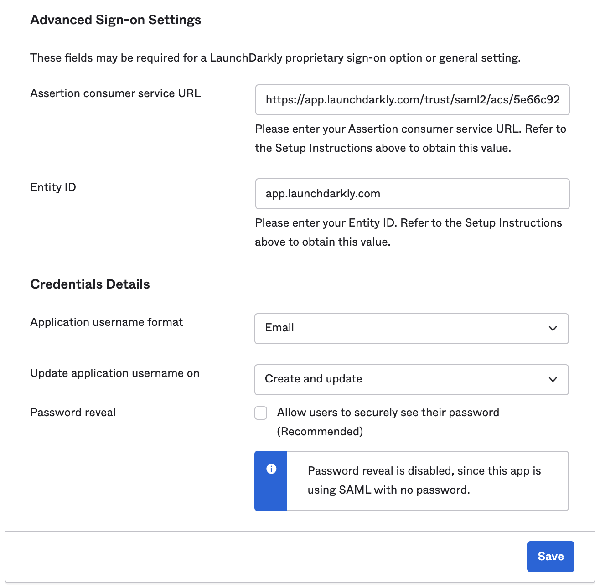
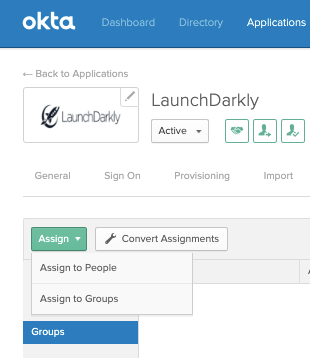
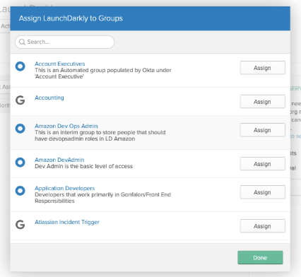
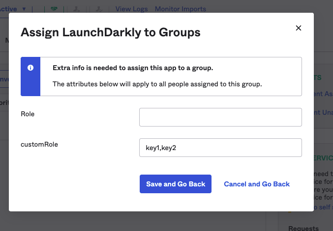
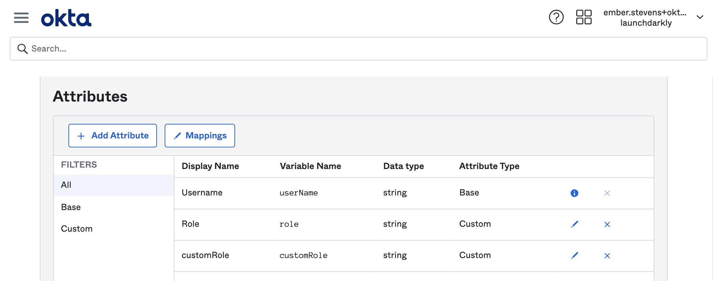

## Overview

This topic explains how Okta and LaunchDarkly work together to provide user management for your user base. Okta and LaunchDarkly communicate through the System for Cross-domain Identity Management (SCIM) API specification. SCIM is designed to make managing user identities in cloud-based applications and services easier.

A LaunchDarkly app is available in Okta. You can connect LaunchDarkly and Okta through the Okta UI, give Okta permissions to modify users in LaunchDarkly, and even integrate LaunchDarkly custom roles with Okta.

## Prerequisites

To use Okta with LaunchDarkly, you must complete the following prerequisites:

- Administrator privileges in LaunchDarkly
- Administrator privileges in Okta
- Follow Okta's documentation to [Enable Single Sign-On with SAML](https://saml-doc.okta.com/SAML_Docs/How-to-Configure-SAML-2.0-for-LaunchDarkly.html)
- You must have access to the email addresses of the users you wish to configure

## Using Okta to manage LaunchDarkly users with SCIM

<Callout intent="info">
  <CalloutTitle>SCIM-based user provisioning is an enterprise feature</CalloutTitle>
  <CalloutDescription>

User provisioning with SCIM is only available to customers on our enterprise plans. If you're interested in learning
more about our enterprise plans, contact [sales@launchdarkly.com](mailto:sales@launchdarkly.com?Subject=Data%20Export).

  </CalloutDescription>
</Callout>

<Callout intent="alert">
  <CalloutTitle>I have more than one SCIM connection!</CalloutTitle>
  <CalloutDescription>

If you get an error during configuration that you cannot add an additional SCIM connection, go to the **Security**
tab in LaunchDarkly's **Account Settings** and click **Disconnect SCIM.** This allows you to connect Okta's
SCIM-based protocols to LaunchDarkly.

  </CalloutDescription>
</Callout>

To get started, navigate to the Okta Administrator Dashboard to add an application and search for LaunchDarkly.

If you have not configured SAML SSO for LaunchDarkly in Okta, you must do that first. To learn more, read [How to configure SAML 2.0 for LaunchDarkly](https://saml-doc.okta.com/SAML_Docs/How-to-Configure-SAML-2.0-for-LaunchDarkly.html) in Okta's documentation.

To authorize Okta to manage your LaunchDarkly users:

1. Log in to Okta as an administrator.
2. Navigate to **Applications** and click \*_Add Application_.\*
3. In the search bar, type "LaunchDarkly". The LaunchDarkly app appears in the search results.

4. Click **Add**. The **General Settings** page for the LaunchDarkly app appears.
5. (Optional) Give the app a custom name by modifying the **Application Label**.
6. (Optional) Configure the **Application Visibility** checkboxes however you prefer.
7. Click **Done**. The LaunchDarkly Application page appears.

You just activated the LaunchDarkly app in Okta.

## Granting Okta permission to manage users in LaunchDarkly

This procedure tells you how to connect the LaunchDarkly app and Okta by using SCIM. This allows you to provision, manage, and deprovision LaunchDarkly users in Okta.

1. Navigate to the LaunchDarkly app in Okta.
2. Click the **Provisioning** tab. The Integration page opens.
3. Click **Configure API Integration**.

4. Check the **Enable API Integration** checkbox and click **Save**. An authorization window appears.
5. Click **Authenticate with LaunchDarkly**. A new browser window opens describing what permissions Okta requires to integrate with LaunchDarkly. Review the permissions and verify that you are comfortable granting them.
6. Click **Authorize**. You return to the Integration page.
7. Click **Save**. The To App page appears.
8. In the Provisioning to App section, click **Edit**. Fields on the screen become configurable. Set the following fields to **Enable**:

- Create Users
- Update User Attributes
- Deactivate Users

9. Click **Save**.

You just connected Okta to LaunchDarkly.

## Setting email addresses as the username

Next, you must configure Okta to recognize email addresses as the usernames for individual users.

<Callout intent="info">
  <CalloutTitle>How LaunchDarkly and Okta use email addresses</CalloutTitle>
  <CalloutDescription>
    LaunchDarkly stores emails in lowercase, and does not differentiate between usernames and email addresses. You may
    use one email address with one LaunchDarkly account at a time. Okta uses email addresses as SCIM usernames. If you
    change a username or email address in Okta or LaunchDarkly after configuration, the corresponding value also
    changes. Only use lowercase letters to configure email addresses. Email addresses including uppercase letters cause
    an error.
  </CalloutDescription>
</Callout>

1. Navigate to the LaunchDarkly app in Okta.
2. Click the **Sign On** tab. The Settings page opens.
3. Use the dropdown to set the Application username format to **Email**.

5. Click **Save**.

You have successfully connected Okta and LaunchDarkly

## Assigning custom roles in Okta

You can assign custom roles that you created in LaunchDarkly to users through the Okta UI. Follow the procedure below to learn how.

<Callout intent="info">
  <CalloutTitle>If you use Okta to manage users, you cannot change back to LaunchDarkly.</CalloutTitle>
  <CalloutDescription>
    SCIM setup takes precedence over LaunchDarkly's configuration options. If you begin to manage users and their role
    assignment in Okta, you must continue managing them in Okta for additional changes to take effect.
  </CalloutDescription>
</Callout>

Use Okta's Group Assignment feature to set up custom roles for a LaunchDarkly user or group. The roles you set up in Okta are passed to LaunchDarkly as user attributes.

To learn more about user attributes, read [Setting user attributes](/home/managing-users/user-attributes).

<Callout intent="alert">
  <CalloutTitle>Users with multiple roles have permissions combining them</CalloutTitle>
  <CalloutDescription>
    If a user has multiple Okta groups representing different roles, they are assigned permissions for all of their
    roles. For example, if a user is in both a Marketing role and a more permissive Engineering role, they can use the
    permissions granted by the Engineering role.
  </CalloutDescription>
</Callout>

Follow this procedure to assign custom roles to groups:

1. Navigate to the LaunchDarkly application's **General Settings** page.
2. Navigate to the **Assignments** tab.
3. In the **Assign** dropdown, choose **Assign to Groups**.

<Callout intent="info">
  <CalloutTitle>Assigning custom roles to one user</CalloutTitle>
  <CalloutDescription>

You can also specify custom roles for individual users by performing this procedure after choosing **Assign to
Users** in step 3.

  </CalloutDescription>
</Callout>

4. Find the groups you want to assign custom roles to and click **Assign**.

5. In the "LaunchDarkly Custom Roles" field, click **Add Another** to open a text box.
6. Enter the key for the custom role you wish to assign to this group. This connects one role to the selected group.

7. Add more custom roles to this group by clicking **Add Another** and repeating step 6.
8. Click **Save and Go Back**.

## Adding custom roles to new users

If you have custom roles already configured in Okta, you can set up custom roles in **Attribute Mapping** when you first set up a user in Okta:

<Callout intent="info">
  <CalloutTitle>Removing existing roles</CalloutTitle>
  <CalloutDescription>
    SAML ignores empty fields if used in user roles or custom roles. If you want to clear all existing roles for a user,
    enter an empty string "" into the field.
  </CalloutDescription>
</Callout>
