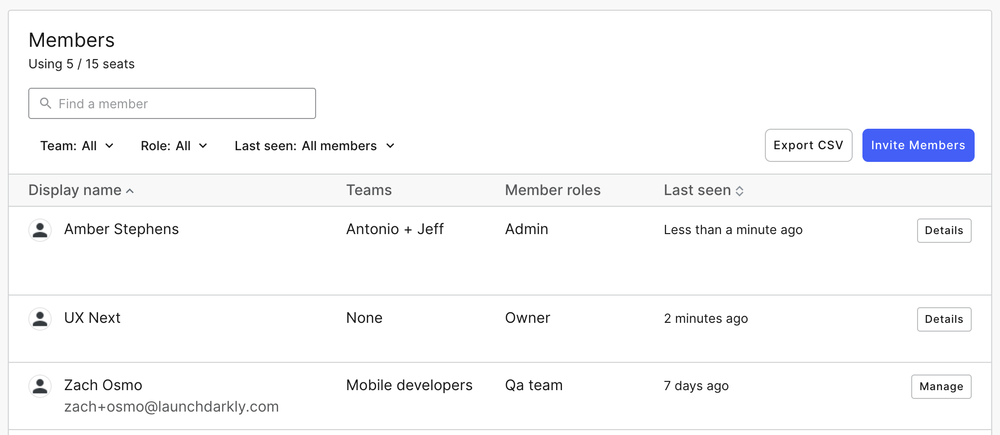

## Overview

This topic introduces the concept of teams and team members in LaunchDarkly and shows you how to use the Team dashboard.

LaunchDarkly supports user object management with OAuth, SAML, and SCIM. To learn more, read [Enabling single sign-on](./single-sign-on).

## Understanding teams in LaunchDarkly

Teams are groups of people who work at your organization or have access rights to your organization's LaunchDarkly environment for another reason, such as contractors or part-time employees.

<Callout intent="info">
  <CalloutTitle>Team members are not LaunchDarkly users</CalloutTitle>
  <CalloutDescription>
    LaunchDarkly users are resources, including people, who encounter feature flags in your app. In many cases, they are
    customers or people accessing your product. To learn more about users, read [The Users
    dashboard](./the-user-dashboard).
  </CalloutDescription>
</Callout>

## Building your team on LaunchDarkly

<Callout intent="alert">
  <CalloutTitle>This is an Admin feature</CalloutTitle>
  <CalloutDescription>
    The Team dashboard is only accessible if you're a LaunchDarkly Admin. To learn more, read [Understanding user
    roles](#understanding-user-roles).
  </CalloutDescription>
</Callout>

Use the **Team** tab to invite new team members to LaunchDarkly, remove old team members, or manage access controls for team members by setting roles.

To access the Team dashboard:

1. Navigate to the the [Account Settings](https://app.launchdarkly.com/settings) page.
2. Click into the [Team](https://app.launchdarkly.com/settings#/team) tab.
3. Enter an email address for someone you wish to invite to LaunchDarkly and click **Send Invitation** or click **Edit** next to an existing user to modify their information.

## Understanding member roles

You can assign different roles to LaunchDarkly members.

LaunchDarkly has several different roles for team members:

<Table>
  <TableHeader>
    <TableHeadCell>Role</TableHeadCell>
    <TableHeadCell>Description</TableHeadCell>
  </TableHeader>
  <TableBody>
    <TableRow>
      <TableCell>
        <code>reader</code>
      </TableCell>
      <TableCell>
        Readers can see information in LaunchDarkly, but can't modify it. This role is perfect for members of your
        organization that need visibility into your feature flags, but shouldn’t be able to modify rollout rules or
        administer the system.
      </TableCell>
    </TableRow>
    <TableRow>
      <TableCell>
        <code>writer</code>
      </TableCell>
      <TableCell>
        Writers can make changes to LaunchDarkly that impact what the platform does. For example, they can modify
        feature flags, metrics, environments, projects, and more. They can’t add new team members to the account or
        manage your payment method or plans. This role is appropriate for team members who need the ability to configure
        how your organization's feature flags work.
      </TableCell>
    </TableRow>
    <TableRow>
      <TableCell>
        <code>admin</code>
      </TableCell>
      <TableCell>
        Admins and owners can do anything in LaunchDarkly. The only difference between them is that you can add or
        remove **admins**, but you cannot remove **owners** from your LaunchDarkly account.
      </TableCell>
    </TableRow>
  </TableBody>
</Table>
<Callout intent="info">
  <CalloutTitle>Assign precise permissions with custom roles</CalloutTitle>
  <CalloutDescription>
    If you need more granular control over which users can do what, custom roles are for you. Custom roles let you
    define specific permissions for users or groups and apply them across your organization. This is great if you have
    users with multiple jobs, such as someone who needs access to flags controlled by an engineering team and the
    support team, or product managers who also code. To learn more, read [Custom
    roles](https://docs.launchdarkly.com/docs/custom-roles).
  </CalloutDescription>
</Callout>

## Enabling multi-factor authentication

For additional security, you can require multi-factor authentication (MFA) for your team. When MFA is enabled, team members won't be able to log in to LaunchDarkly without verifying their identity with a second method.

We strongly recommend that all LaunchDarkly users enable MFA for their account, and that administrators enforce MFA for their entire team. In the event of a credential leak or device theft, MFA can prevent malicious third parties from accessing a LaunchDarkly account they should not be able to access.

To learn more, read [Multi-factor authentication](./multi-factor-authentication).

## Inviting users with trial accounts

Sometimes when you invite a user to LaunchDarkly, you get an error saying the email address is already in use.

This can happen when a person has already used their email address to create a trial account in LaunchDarkly. Ask the person to delete their trial account and add them to your LaunchDarkly organization again, or tell people in your organization to delete their trials before you roll out LaunchDarkly organization-wide.

## Using aliased email addresses in LaunchDarkly

Alternatively, if the user has a GSuite or Outlook 365 account, you can invite them to LaunchDarkly using an alias. An alias account is the email address of the person you wish to invite with a plus sign (`+`) and additional text string appended. `joe@example.com+launchdarkly` is an alias of `joe@example.com`.

For example, if the user object `alice@diner.com` already exists in LaunchDarkly, you can also invite `alice+newproject@diner.com` to your LaunchDarkly organization. Emails from both addresses are sent to `alice@diner.com`, but only `alice+newproject@diner.com` has access to your LaunchDarkly organization. This is also helpful when you need contractors to collaborate with you on projects.
