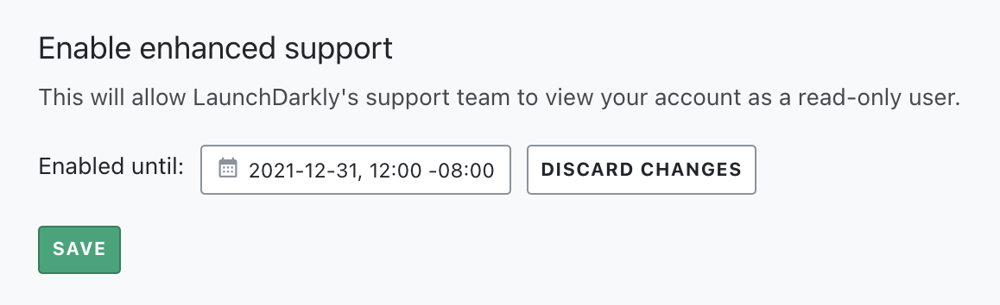

## Overview

This topic explains how to enable and disable enhanced support in LaunchDarkly. Enhanced support allows us to view your account as a read-only user. This makes it easier for us to investigate issues in your LaunchDarkly account and help resolve them.

Enabling enhanced support helps us troubleshoot issues such as:

- Unexpected behavior on your dashboard
- Understanding events in the debugger
- Missing users from your User dashboard
- Missing flag updates

You can disable enhanced support at any time.

## Enabling enhanced support

You can enable enhanced support at any time. We may ask you to follow this procedure when you contact us for help.

To enable enhanced support:

1. Navigate to the **Account Settings** page.
2. Click into the **Security** tab and scroll to the "Enable enhanced support" section.
3. Click **Enable**.
4. Choose the date and time at which you want enhanced support to expire:

5. Click **Save**.

Enhanced support is now enabled, and will automatically expire on the date and time you chose.

## Disabling enhanced support

You can manually disable enhanced support before the expiration date you chose.

To manually disable enhanced support:

1. Navigate to the **Account Settings** page.
2. Click into the **Security** tab and scroll to the "Enable enhanced support" section.
3. Click **Discard changes**.
4. Click **Save**.

Enhanced support is now disabled.
