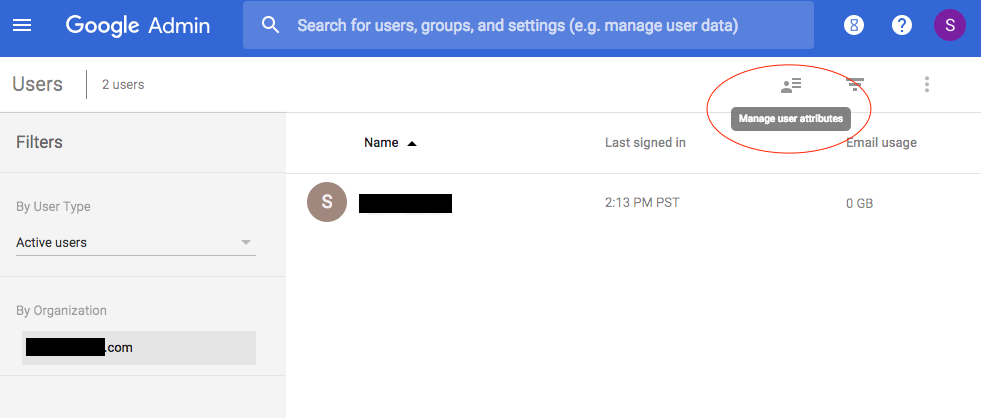
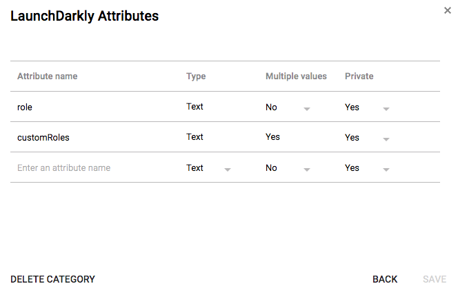
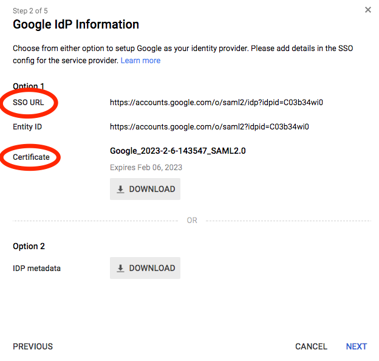
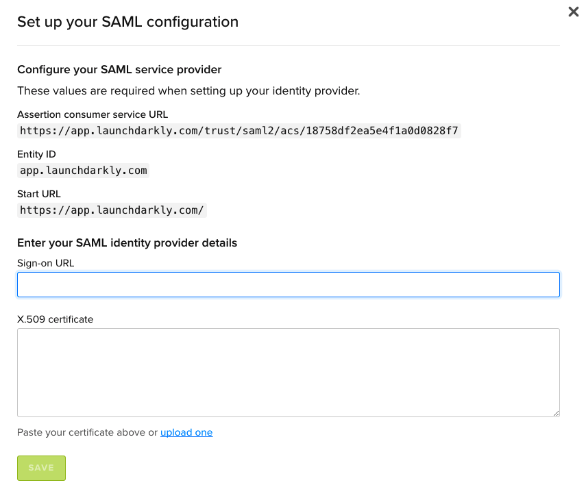
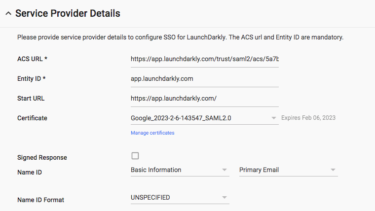
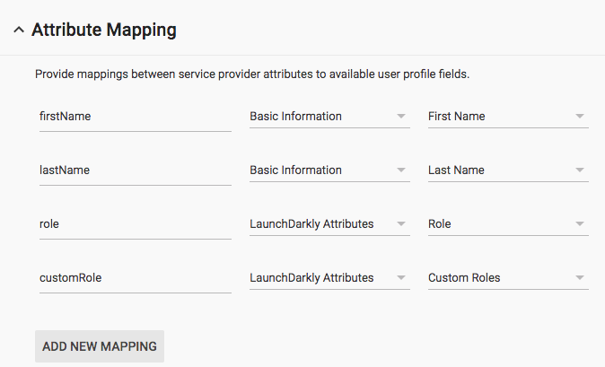
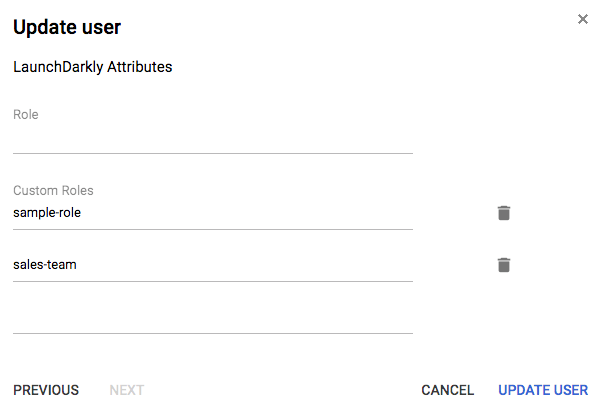

## Overview

This topic explains how to configure GSuite to support SSO in LaunchDarkly.

## Prerequisites

To configure SSO for LaunchDarkly using GSuite, you must complete the following prerequisite:

- Configure SAML for authentication. For more information, read the [Google knowledge base](https://support.google.com/a/answer/6087519).

Use the table below to configure Google fields for LaunchDarkly:

<Table>
  <TableHeader>
    <TableHeadCell>Google field</TableHeadCell>
    <TableHeadCell>LaunchDarkly setting</TableHeadCell>
  </TableHeader>
  <TableBody>
    <TableRow>
      <TableCell>ACS URL</TableCell>
      <TableCell>Use LaunchDarkly's Assertion Consumer Service URL value.</TableCell>
    </TableRow>
    <TableRow>
      <TableCell>Entity ID</TableCell>
      <TableCell>Use LaunchDarkly's Entity ID value.</TableCell>
    </TableRow>
    <TableRow>
      <TableCell>Start URL</TableCell>
      <TableCell>Use LaunchDarkly's Start URL value.</TableCell>
    </TableRow>
    <TableRow>
      <TableCell>Signed Response</TableCell>
      <TableCell>Check this box.</TableCell>
    </TableRow>
    <TableRow>
      <TableCell>Name ID</TableCell>
      <TableCell>Select "Basic Information" and "Primary Email"</TableCell>
    </TableRow>
    <TableRow>
      <TableCell>Name ID Format</TableCell>
      <TableCell>Select "EMAIL"</TableCell>
    </TableRow>
    <TableRow>
      <TableCell>Attribute Mapping</TableCell>
      <TableCell>
        Enter <code>role</code> as the <code>application attribute</code>, and select the{' '}
        <a href="https://support.google.com/a/answer/6208725?hl=en">custom user attribute</a> that corresponds to the
        desired role.
      </TableCell>
    </TableRow>
  </TableBody>
</Table>

## Configuring SSO for LaunchDarkly with GSuite

Before you create the LaunchDarkly app in GSuite, you must create the LaunchDarkly specific fields for roles and custom roles.

To configure these fields:

1. Log into GSuite.
2. Navigate to your user directory by clicking **Directory** and then **Users**.
3. Click the **Manage user attributes** icon. A popup screen appears:

4. Select **Add Custom Category**.
5. Name the custom category whatever you like. In the example below, we used **LaunchDarkly Attributes**.
6. Add `role` and `customRoles` fields:

<Callout intent="info">
<CalloutTitle>Allow multiple values for custom roles</CalloutTitle>
<CalloutDescription>

Set the "Multiple values" field for `customRoles` to **Yes**. Some users may have more than one custom role, which requires multiple values.

</CalloutDescription>
</Callout>

## Adding LaunchDarkly as a Custom SAML Application

Next, you must add LaunchDarkly to your GSuite apps.

To add LaunchDarkly:

1. Navigate to **Apps** > **SAML Apps**.
2. Click the plus button to **Add** an app.
3. Select **Setup my own Custom App** to configure LaunchDarkly. The setup workflow initiates.
4. In step 2 of the workflow, enter the information from the setup workflow into LaunchDarkly's **Security** tab under **Edit SAML Configuration**:

5. In step 4 of the workflow, provide the **Assertion consumer service URL**, **entity ID **and **start URL** for your LaunchDarkly account. To find them, click **Edit your SAML configuration** on the LaunchDarkly **Security** tab:

6. In step 3, enter the name of the app.
7. In step 4, enter LaunchDarkly’s service provider details as shown in the screenshot below:

8. In step 5, map the LaunchDarkly attributes `firstName` and `lastName` to Google’s “Basic Information” fields of the same names. Map `role` and `customRole` to our LaunchDarkly attributes as shown below:

<Callout intent="alert">
<CalloutTitle>Names are case sensitive</CalloutTitle>
<CalloutDescription>

In the screenshot above, the names in the lefthand columns map to those present in LaunchDarkly. You must name them exactly as shown or configuration will fail.

</CalloutDescription>
</Callout>

You've successfully connected LaunchDarkly to GSuite.

## Assigning roles and custom roles with GSuite

Now that the application is configured, you can assign roles to users.

To assign roles:

1. Log into GSuite.
2. Navigate to **Directory** > **Users**.
3. Click on the user that you want to assign roles to and choose **Account** to bring up the user's account settings.
4. Click **Edit** beneath “Manage user attributes” to add the user’s role(s) to the corresponding attribute fields:

5. Click **Update User.**

The next time your user logs into LaunchDarkly through GSuite, their roles will update. If this is a brand new LaunchDarkly account member, an account will be created automatically with the roles you specified.
