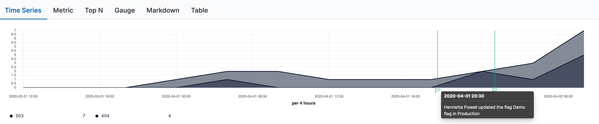
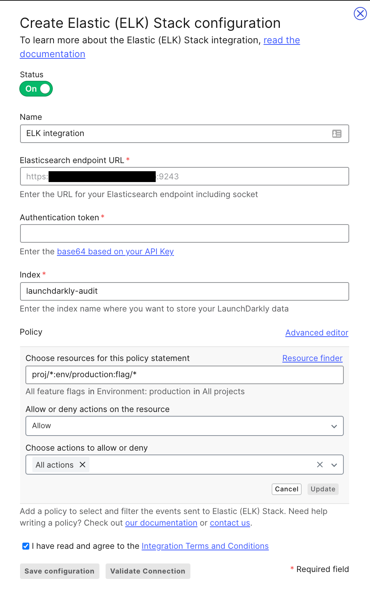

## Overview

This topic explains how to use the LaunchDarkly Elastic (ELK) Stack integration. [The Elastic Stack](https://elastic.co), which is also referred to as the [ELK Stack](https://elastic.co/elk), is a versatile search platform with many use cases, from site and application search to observability and security. 

LaunchDarkly's Elastic Stack integration supports log aggregation and data and timeseries visualization.

For example, an engineer is alerted to an anomaly in their application's behavior. With the LaunchDarkly Elastic Stack integration sending data to their observability stack, they can easily correlate flag changes atop timeseries and see what changes happened just before the anomalous activity.



Development teams could also build data visualizations around their LaunchDarkly audit log data to find out more about who interacts with or modifies their feature flags. You can even use Elasticsearch to find specific information in your logs. 

## Prerequisites

To configure the Elastic integration, you must have the following prerequisites:

* **Your Elasticsearch endpoint URL** This is the destination to which LaunchDarkly sends its data. It must include the socket number. If you are using the Elastic Search Service from Elastic Cloud, you can find your endpoint URL by clicking your deployment name and selecting **Copy Endpoint URL** just below the Elasticsearch logo.

* **API Key credentials**: To learn more about getting an API key, read [Elastic's API Key Documentation](https://www.elastic.co/guide/en/elasticsearch/reference/current/security-api-create-api-key.html). Ensure this key gives permission to write to the appropriate Elasticsearch index.

* **Elasticsearch index**: The Elasticsearch index indicates which index the LaunchDarkly data should be written to in your cluster. You can use the default or choose your own.

## Configuring the Elastic Stack integration

Here's how to configure the Elastic Stack integration:

1. Navigate to the <Link to="https://app.launchdarkly.com/default/integrations">LaunchDarkly integrations</Link> page. 
2. Click to expand the Elastic (ELK) Stack card.
3. Click **+ integration**.



4. (Optional) Enter a human-readable **Name**.
5. Paste in the **Elasticsearch Endpoint URL**.
6. Paste in the **Authentication Token**. This is the base64 encoding of `id` and `api_key`, joined by a colon.
7. Enter or use the default value for the **Elasticsearch Index** to which you want to write your LaunchDarkly data.
8. Click **Save Elastic (ELK) Stack Configuration**.

After you configure the integration, LaunchDarkly sends flag, environment, and project data to your Elastic cluster.

## Choosing what data to send

The _Policy_ configuration field allows you to control which kinds of LaunchDarkly events are sent to Elasticsearch. The default policy value restricts it to flag changes in production environments:

<CodeTabs
  defaultValue="txt"
  values={[
    { label: 'Policy example', value: 'txt', },
  ]
}>

<CodeTabItem value="txt">

```txt
proj/*:env/production:flag/*
```

</CodeTabItem>
</CodeTabs>

You may want to override the default policy if you wanting to restrict the integration to a specific combination of LaunchDarkly projects and environments or to a specific action or set of actions.

In the example below, the policy restricts LaunchDarkly to only send changes from the `web-app` project's production environment to Elasticsearch:

<CodeTabs
  defaultValue="txt"
  values={[
    { label: 'Policy example', value: 'txt', },
  ]
}>

<CodeTabItem value="txt">

```txt
proj/web-app:env/production:flag/*
```

</CodeTabItem>
</CodeTabs>

### Sending more data to Elasticsearch 

Alternatively, you use the integration to monitor not just flag changes, but all environment and project changes. If you want to send absolutely everything to Elasticsearch, you must add policies for project and environment data:

To send more data to Elasticsearch:

1. Navigate to the LaunchDarkly [Integrations](https://app.launchdarkly.com/default/integrations) page. 
2. Click to **Edit** the Elastic (ELK) Stack card.
3. If the current policy is already expanded, click **cancel** in the lower-right. Otherwise click **+ Add statement** under _Policy_.
4. Enter a statement for the resources you would like to send to Elasticsearch. For example, `proj/*` will send all project data and `proj/*:env/*` will send all environment data from all projects.
5.  Click **Update**.
6. Repeat steps 2 and 3 for each additional category of data you'd like sent to Elasticsearch.
6. When you've added all the policies you wish, click **Save Elastic (ELK) Stack Configuration**.

To learn more about setting custom policies, read [Policies in custom roles](/home/account-security/custom-roles/policies).

## Using the integration with Kibana

Kibana is a frontend application that provides search and data visualization for data indexed in Elasticsearch.

After you configure the Elastic (ELK) Stack integration, your LaunchDarkly data streams to Elasticsearch and becomes available for searching. You can use Kibana to visualize the data Elastic (ESK) Stack receives. 

You must configure your Kibana instance to retrieve this data and display it in its own visualizations or annotate your existing timeseries charts.

To make data available to Kibana, you must create a new **index pattern**:

1. Log into your Kibana instance.
2. Navigate to **Settings** in the left-hand navigation by clicking on the **gear icon**.
3. Under Kibana, select **Index Patterns**.
4. Click **Create Index Pattern**.
5. Enter the appropriate pattern to refer to your LaunchDarkly index or indices. If you used the default value, `launchdarkly-audit` will match specifically that new index. Wildcards are supported, so you may want to end your pattern with `*` to support feature log index cycling.
6. Choose `date` for the **Time Filter field name**. 
7. Click **Create index pattern**.
8. Verify your data appears correctly by using the **Discover** section of Kibana and selecting your new index pattern.

Now you can use your LaunchDarkly data alongside everything else in Kibana. 

## Other resources

You can continue reading Elastic's documentation to learn more about these products:

* To learn more about visualizations in Kibana, read [Kibana's documentation](http://www.elastic.co/guide/en/kibana/current/visualize.html).
* To learn more about index patterns, read the [Elastic Kibana guide](http://www.elastic.co/guide/en/kibana/current/index-patterns.html).

