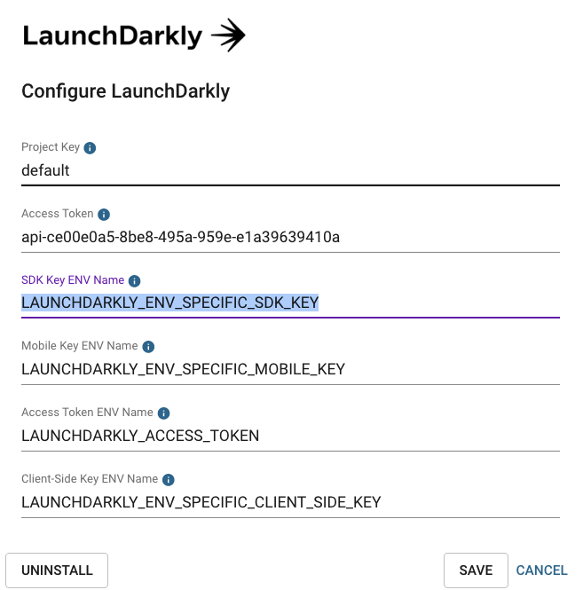

## Overview 

This topic explains how to use the LaunchDarkly Release integration. Release is the easiest way to implement Kubernetes in your cloud and create production-like environments on pull requests or for QA, sales environments, and more.

Release's LaunchDarkly integration lets you have an isolated LaunchDarkly environment to use for testing. One of the difficulties you may have when utilizing feature flags is dealing with multiple environments. You can try to share your feature flag environments with multiple staging or pre-production environments, but that can cause testing and reliability issues, similar to the risks of sharing a database between multiple environments.

The Release integration prevents these issues by creating a new LaunchDarkly environment every time you deploy a new Release environment. It also stores the SDK keys, mobile keys, and client IDs as environment variables that your application can access. Release handles both creation and deletion of LaunchDarkly environments, while requiring minimal configuration.

## Setting up the integration

To set up the integration:

1. Log in to your Release account.
2. Navigate to **Manage Accounts** 
 
 

3. Choose your account. 

 

4. Choose **Integrations** and find "LaunchDarkly" in the "Available Integrations" section. 
5. Click **Setup** to set up the integration. The set up form appears.

 


Every field in the set up form is required, and all but one have defaults you can use. 

Here are descriptions of the fields in the set up form:

* **Project Key**: This is the key for the project where you wish to create environments. The default value is _default_ , because LaunchDarkly always has a project with key _default_.
* **Access Token**: This is the token for the account you would like Release to create environments under in LaunchDarkly. You can create or find the access token you want to use in LaunchDarkly in the **Authorization** tab of the **Account Settings** page. All access tokens start with **api-**.
* **Environment Variables**: The last three form elements define the names of the environment variables where Release stores the relevant API keys from LaunchDarkly. You can change them to anything you like. You may need the LaunchDarkly access token to set up your SDK client to choose flag variations in your application. After you set up the environment in LaunchDarkly, Release stores the various API keys values in these environment variables. This gives your container access to the API keys you need. They are stored as encrypted Kubernetes secrets.



After you save the configuration, Release attempts to use your **Access Token** to connect to your LaunchDarkly account. If that works, you're done. The integration is ready to go. If not, errors appear for you to troubleshoot.

## Using LaunchDarkly with the Release integration

The integration consists of two parts, both of which are automated and handled by Release.

* **[Pre-Deployment step](#using-the-pre---deployment-step):** In this step, the integration adds a task to each of your deployments to create the feature flag environment.
* **[Pre-Delete step](#using-the-pre---delete-step):** When you delete an environment, this step deletes the environment in LaunchDarkly.


### Using the Pre-Deployment step

The Pre-Deployment step is for when you first deploy a space or deploy a new configuration. It only creates the environment in LaunchDarkly the first time it runs.


After a successful creation, the environment variables you specified during set up populate and are exposed to your containers with Kubernetes secrets.


You can use these environment variables in your code to access your feature flags. 

### Using the Pre-Delete step

The Pre-Delete step is invoked anytime a Release environment is removed, either manually through the UI or after a pull request is merged or closed. The integration removes the corresponding LaunchDarkly environment automatically when the Release environment is removed.

## Example: Setting up the LaunchDarkly SDK client in Rails

 In this example we will configure the LaunchDarkly SDK client with the specific API key for your environment.

This example is based on the [Ruby SDK reference](/sdk/server-side/ruby). 

<Callout intent="info">
  <CalloutDescription>
  When running locally you can use the 'dotenv gem' (https://github.com/bkeepers/dotenv) to set your LaunchDarkly environment variables to test values.
  </CalloutDescription>
</Callout>


* Install the Ruby SDK GEM - https://github.com/launchdarkly/ruby-server-sdk
* Create a file in `config/initializers/launchdarkly_client.rb`
* Copy the code below into `config/initializers/launchdarkly_client.rb`

```ruby
=begin

  #Uncomment this section if you would like to use the 'launchdarkly_api' gem (https://github.com/launchdarkly/api-client-ruby)
  #This is NOT the gem for using the Ruby LaunchDarkly SDK (https://github.com/launchdarkly/ruby-server-sdk)
  #Most people do not need to utilize the LaunchDarkly Rest API defined here : (https://apidocs.launchdarkly.com/reference), but
  #instead just want to use the SDK to interact with the feature flags in their specific environment.
  #If you would like to utilize the LaunchDarkly Rest Api make sure to install the gem besides uncommenting these lines.

access_token = ENV['LAUNCHDARKLY_ACCESS_TOKEN']

LaunchDarklyApi.configure do |config|
  config.api_key['Authorization'] = access_token
  config.debugging = true
end

=end

##In order to utilize the LaunchDarkly Ruby SDK, you will need the specific SDK key
##In this example I'm setting up 'ld_client' under the Rails.configuration so it's accessible anywhere
##in your Rails Project
Rails.configuration.ld_client = 
  LaunchDarkly::LDClient.new(ENV['LAUNCHDARKLY_ENV_SPECIFIC_SDK_KEY'])
```

### Example of using the ld_client you defined above in your Rails application

```ruby
test_flag = Rails.configuration.ld_client.variation("test-flag", {key: "user@test.com"}, false)
```

**That's all there is to it!  Now you can start using your feature flags or if this is an existing app, everything related to querying and getting the current values of your flags should work in any environment.**
