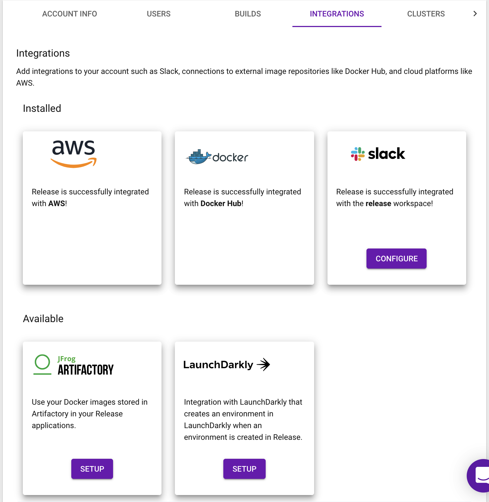

## Overview 

This topic explains how to use the LaunchDarkly Release integration. Release is the easiest way to implement Kubernetes in your cloud and create production-like environments on pull requests or for QA, sales environments, and more.

Release's LaunchDarkly integration lets you have an isolated LaunchDarkly environment to use for testing. One of the difficulties you may have when utilizing feature flags is dealing with multiple environments. You can try to share your feature flag environments with multiple staging or pre-production environments, but that can cause testing and reliability issues, similar to the risks of sharing a database between multiple environments.

The Release integration prevents these issues by creating a new LaunchDarkly environment every time you deploy a new Release environment. It also stores the SDK keys, mobile keys, and client IDs as environment variables that your application can access. Release handles both creation and deletion of LaunchDarkly environments, while requiring minimal configuration.

## Setting up the integration

To set up the integration:

1. Log in to your Release account.
2. Navigate to **Manage Accounts** 
 
 

3. Choose your account. 

 

4. Choose **Integrations** and find "LaunchDarkly" in the "Available Integrations" section. 
5. Click **Setup** to set up the integration. The set up form appears.

 


Every field in the set up form is required, and all but one have defaults you can use. 

Here are descriptions of the fields in the set up form:

* **Project Key**: This is the key for the project where you wish to create environments. The default value is _default_ , because LaunchDarkly always has a project with key _default_.
* **Access Token**: This is the token for the account you would like Release to create environments under in LaunchDarkly. You can create or find the access token you want to use in LaunchDarkly in the **Authorization** tab of the **Account Settings** page. All access tokens start with **api-**.
* **Environment Variables**: The last three form elements define the names of the environment variables where Release stores the relevant API keys from LaunchDarkly. You can change them to anything you like. You may need the LaunchDarkly access token to set up your SDK client to choose flag variations in your application. After you set up the environment in LaunchDarkly, Release stores the various API keys values in these environment variables. This gives your container access to the API keys you need. They are stored as encrypted Kubernetes secrets.


Once you have saved it, Release attempts to use your **Access Token** to connect to your LaunchDarkly account. If that works, you're done. The integration is ready to go! If not, you'll see errors and can correct any mistakes you have made.

## Utilizing the LaunchDarkly Integration

The integration consists of two parts, both of which are automated and handled by Release.

* **[Pre-Deployment step](#using-the-pre---deployment-step):** In this step, the integration adds a task to each of your deployments to create the feature flag environment.
* **[Pre-Delete step](#using-the-pre---delete-step):** When you delete an environment, this step deletes the environment in LaunchDarkly.


### Pre-Deployment Step

The Pre-Deployment step is for when you first deploy a space or deploy a new configuration. But, it only creates the environment in LaunchDarkly the very first time it runs.


Upon successful creation, the environment variables you specified during setup are populated and exposed to your containers via K8s secrets.


You can then use these environment variables in your code to access your feature flags as you normally would. 

### Pre-Delete Step

The Pre-Delete step is invoked anytime a Release Environment is removed, whether that be manually through the UI or upon merge/closure of a pull request. The LaunchDarkly integration removes the corresponding LaunchDarkly environment automatically upon removal of the Release Environment.

## Example: Setting up LaunchDarkly SDK Client in Rails

To use LaunchDarkly in your application, you must do two things:

* Authorize against LaunchDarkly with your access token
* Configure the LaunchDarkly SDK client with the specific API key for your environment

This example is based on the [Ruby SDK reference](/sdk/server-side/ruby). It also uses the [dotenv gem](https://github.com/bkeepers/dotenv) to put in default values when you run it locally.


<Callout intent="info">
<CalloutTitle>Use the API key for your LaunchDarkly environment.</CalloutTitle>
  <CalloutDescription>
    When you run this example locally, configure the LAUNCHDARKLY_ENV_SPECIFIC_SDK_KEY with the API key for the LaunchDarkly development environment.
  </CalloutDescription>
</Callout>

Create a file in `config/initializers/launchdarkly_client.rb`

<CodeTabs
  defaultValue="ruby"
  values={[
    { label: 'Ruby', value: 'ruby', }
  ]
}>

    <CodeTabItem value="ruby">

    ```ruby
##Retrieve the access token from system ENVS or
##local envs with dotenv

access_token = ENV['LAUNCHDARKLY_ACCESS_TOKEN']

##Set up authorization using access token

LaunchDarklyApi.configure do |config|
  config.api_key['Authorization'] = access_token
  config.debugging = true
end

## Set ld_client to use the API key for the specific environment

Rails.configuration.ld_client = 
  LaunchDarkly::LDClient.new(ENV['LAUNCHDARKLY_ENV_SPECIFIC_SDK_KEY'])
This authenticates with LaunchDarkly using the access token you entered during setup and sets your SDK client using the SDK API key from the environment that was set up on your behalf.```

`test_flag = Rails.configuration.ld_client.variation("test-flag", {key: "user@test.com"}, false)`

Now you can use retrieve variants for feature flags exactly how you would had you entered the API key manually, but with more security and the flexibility you need in each testing environment.  
