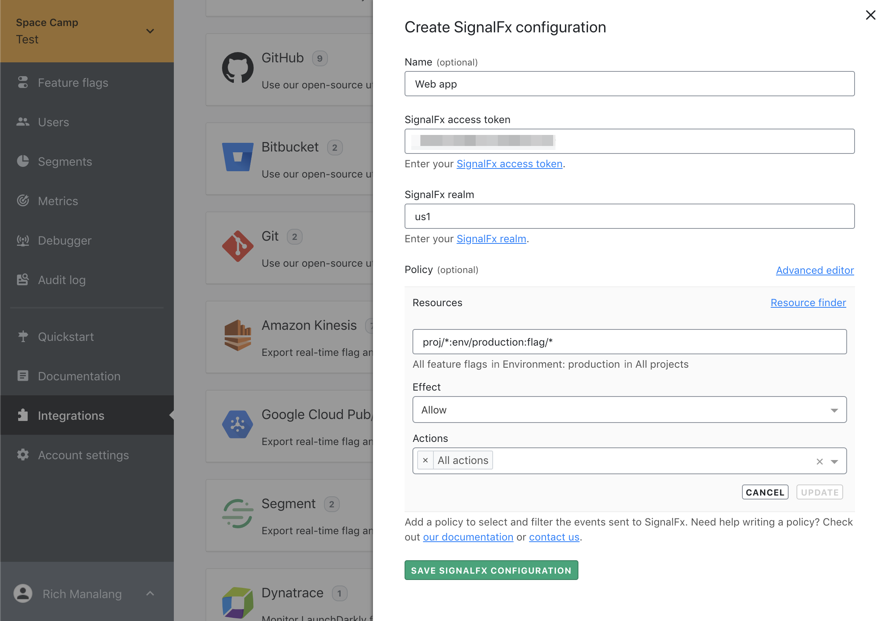
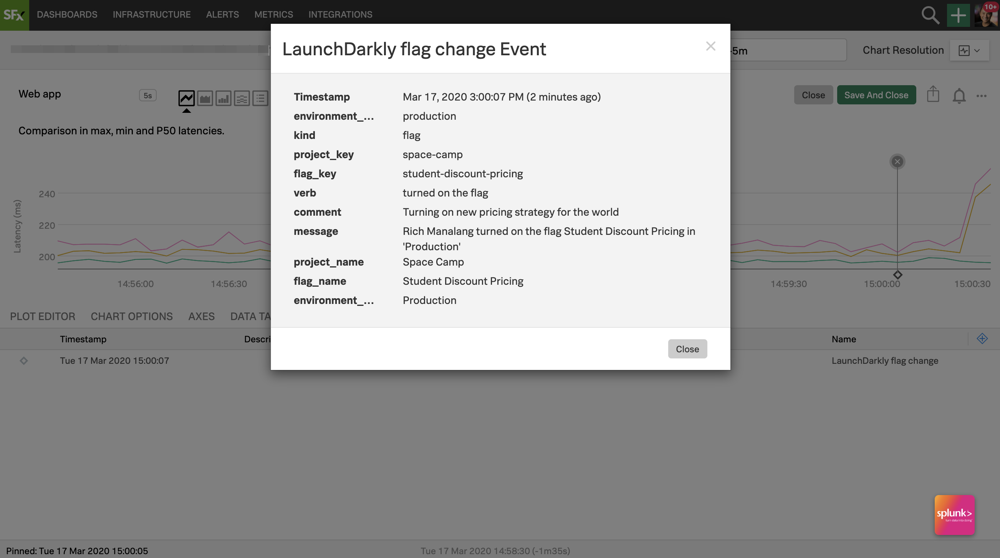

## Overview

This topic explains how to use the LaunchDarkly SignalFx integration. [SignalFx](https://www.signalfx.com/) is an [application performance management (APM)](https://en.m.wikipedia.org/wiki/Application_performance_management) tool. It allows customers to monitor the operational health of their application and infrastructure.

SignalFx can detect and alert engineers when their applications are trending in an unstable direction. In doing so, these engineers will likely want to identify what changed and caused the application to become unstable. One potential cause could be the toggling of a feature flag. The LaunchDarkly SignalFx integration works to streamline this use case by exposing flag change data to SignalFx.


With clear data markers representing feature flag changes, SignalFx users can more easily correlate their feature flag rollouts with changes in operational health.

## Prerequisites

To configure the SignalFx integration, you must have the following prerequisites:

* **SignalFx access token**: This token authenticates your LaunchDarkly account to send data to your SignalFx account. To learn more about about working with SignalFx access tokens, read [SignalFx's documentation](https://docs.signalfx.com/en/latest/admin-guide/tokens.html#working-with-access-tokens).
* **SignalFx realm**: The realm identifies the self-contained deployment of SignalFx that hosts your organization. Find the name of your organization's realm on your SignalFx profile page.

## Configuring the SignalFx integration

Here's how to configure the SignalFx integration:

1. Navigate to the <Link to="https://app.launchdarkly.com/default/integrations">LaunchDarkly integrations</Link> page. 
2. Click to expand the SignalFx card.
3. Click **Add integration**.



4. (Optional) Enter a human-readable **Name**.
5. Paste in your **SignalFx Access Token**.
6. Paste in your **SignalFx Realm**.
7. (Optional) Configure a custom policy to control which flag information LaunchDarkly sends to SignalFX. To learn more about this option, read [Advanced configuration](#advanced-configuration).
8. Click **Save SignalFx Configuration**.

When you configure the integration correctly, LaunchDarkly sends flag change data to SignalFx.

## Advanced configuration

The _Policy_ configuration field allows you to control which kinds of LaunchDarkly events are sent to SignalFx. The default policy value restricts it to flag changes in production environments:

<CodeTabs
  defaultValue="txt"
  values={[
    { label: 'Policy example', value: 'txt', },
  ]
}>

<CodeTabItem value="txt">

```txt
proj/*:env/production:flag/*
```

</CodeTabItem>
</CodeTabs>

Reasons to override the default policy include wanting to restrict the integration to:

- a specific combination of LaunchDarkly projects/environments
- a specific action (or set of actions)


For example, setting the policy configuration to the following will restrict LaunchDarkly such that only changes from the `web-app` project's production environment are sent to SignalFx:

<CodeTabs
  defaultValue="txt"
  values={[
    { label: 'Policy example', value: 'txt', },
  ]
}>

<CodeTabItem value="txt">

```txt
proj/web-app:env/production:flag/*
```

</CodeTabItem>
</CodeTabs>

To learn more about setting custom policies, read [Policies in custom roles](/home/account-security/custom-roles/policies).

## Using the integration

After you configure the integration, SignalFx charts are annotated with LaunchDarkly flag changes. 

To do this:

1. Log into your SignalFx account.
2. On the "Plot Editor" panel, click **Add Metric or Event**.
2. Select **LaunchDarkly flag changed**.
3. (Optional) Add a filter if you wish to filter by a specific LaunchDarkly attribute such as project or environment.
4. Click **Save** to save your chart changes.

SignalFx's "Chart Options" tab also lets you view LaunchDarkly events as small marks or lines. Click on the annotations in your chart to see additional details.

To learn more, read [SignalFx's documentation](https://docs.signalfx.com/en/latest/charts/chart-options-tab.html#event-lines).


