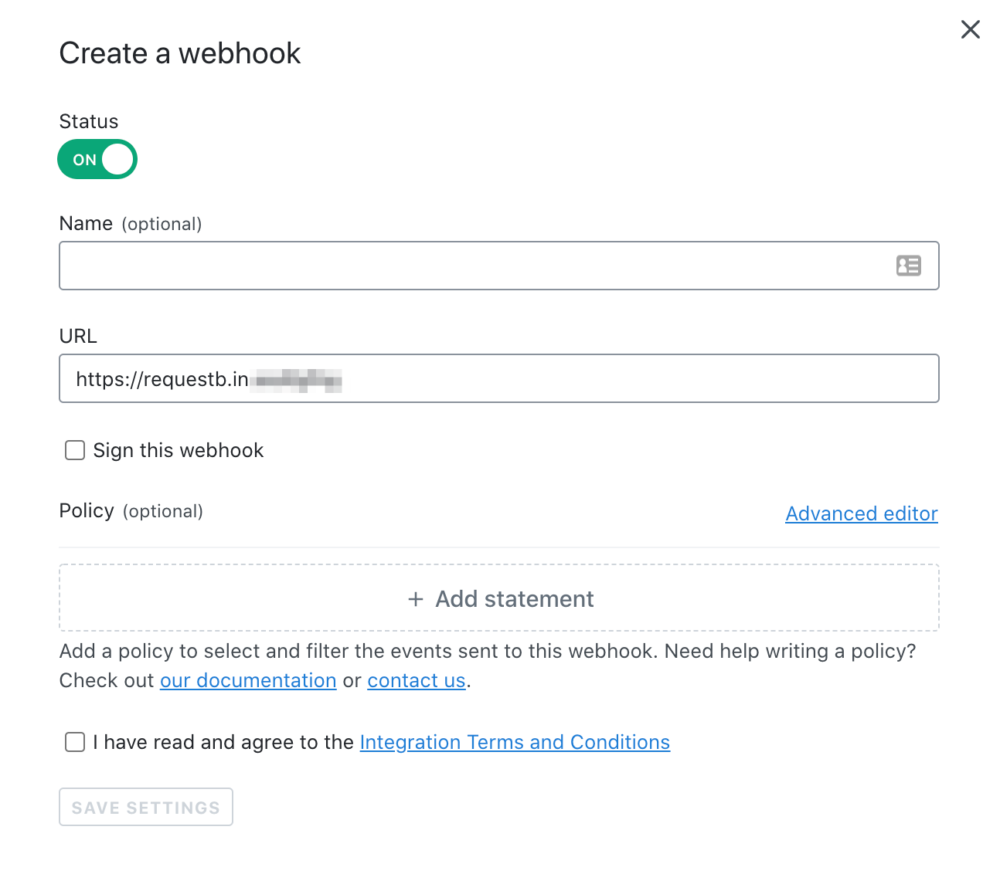

## Overview

This topic explains how to create and use webhooks in LaunchDarkly.

LaunchDarkly's webhooks allow you to build your own integrations that subscribe to changes in LaunchDarkly. When something changes, like when a feature flag is updated, or when a team member is invited to LaunchDarkly, we'll send an HTTP POST payload to the webhook's configured URL.

Use webhooks to update external issue trackers, update support tickets, notify customers of new feature rollouts, and more.



## Creating a webhook

To create a webhook, click the New Webhook button on your [Integrations](https://app.launchdarkly.com/integrations) page.

Provide an absolute URL, whether the webhook should be signed, and a optional policy.

## Signing webhooks

When creating a webhook, you can define an optional secret. If defined, the webhook `POST` request will include an `X-LD-Signature` header, whose value will contain an HMAC SHA256 hex digest of the webhook payload, using the secret as the key.

You should compute the signature of the payload using the same shared secret in your code to verify that the webhook was triggered by LaunchDarkly.


You can use the auto-generated secret, or supply your own when creating or editing a webhook.

## Adding a policy filter

By default, a webhook without a policy filter will receive a payload for any change in LaunchDarkly (across any project, environment, goal, feature flag, etc.). You can optionally specify a policy (using the same syntax as our [custom roles](/home/account-security/custom-roles) feature to filter the events sent to your webhook.

For example, if you only want to receive an event when a change is made to one of your production feature flags, you can add the following policy to your webhook:

<CodeTabs
  defaultValue="json"
  values={[
    { label: 'Example policy for your webhook', value: 'json', },
  ]
}>
<CodeTabItem value="json">

```json
{
  "effect": "allow",
  "resources": [
    "proj/*:env/production:flag/*"
  ],
  "actions": [
    "*"
  ]
}
```

</CodeTabItem>
</CodeTabs>


## Payload format

The webhook payload format is identical to the entry format for the [audit log](/home/managing-flags/audit-log-history). See our [REST API Documentation](https://apidocs.launchdarkly.com/docs/webhooks-overview#payload) for an example payload.

<Callout intent="info">
  <CalloutTitle>Webhook delivery order</CalloutTitle>
  <CalloutDescription>
    Note that webhooks may not be delivered in chronological order. We recommend using the payload's "date" field as a
    timestamp to reorder webhooks as they are received.
  </CalloutDescription>
</Callout>

The webhook payload format is identical to the entry format for the [audit log](/home/managing-flags/audit-log-history). See our [REST API Documentation](https://apidocs.launchdarkly.com/docs/webhooks-overview#payload) for an example payload.

<Callout intent="info">
  <CalloutTitle>Webhook delivery order</CalloutTitle>
  <CalloutDescription>
    Note that webhooks may not be delivered in chronological order. We recommend using the payload's "date" field as a
    timestamp to reorder webhooks as they are received.
  </CalloutDescription>
</Callout>

## Retries

If LaunchDarkly receives a non-2xx response to a webhook `POST`, it will attempt to retry the delivery once. Webhook delivery is not guaranteed, and integrations built on webhooks should be tolerant of delivery failures.

## Disabling webhooks

You can temporarily disable a webhook by hitting the On/Off switch on the [Integrations](https://app.launchdarkly.com/integrations) page.

## Testing webhooks

If you need to generate a test URL, we recommend using [RequestBin](https://requestbin.com/) or [Mockbin](http://mockbin.org/).
